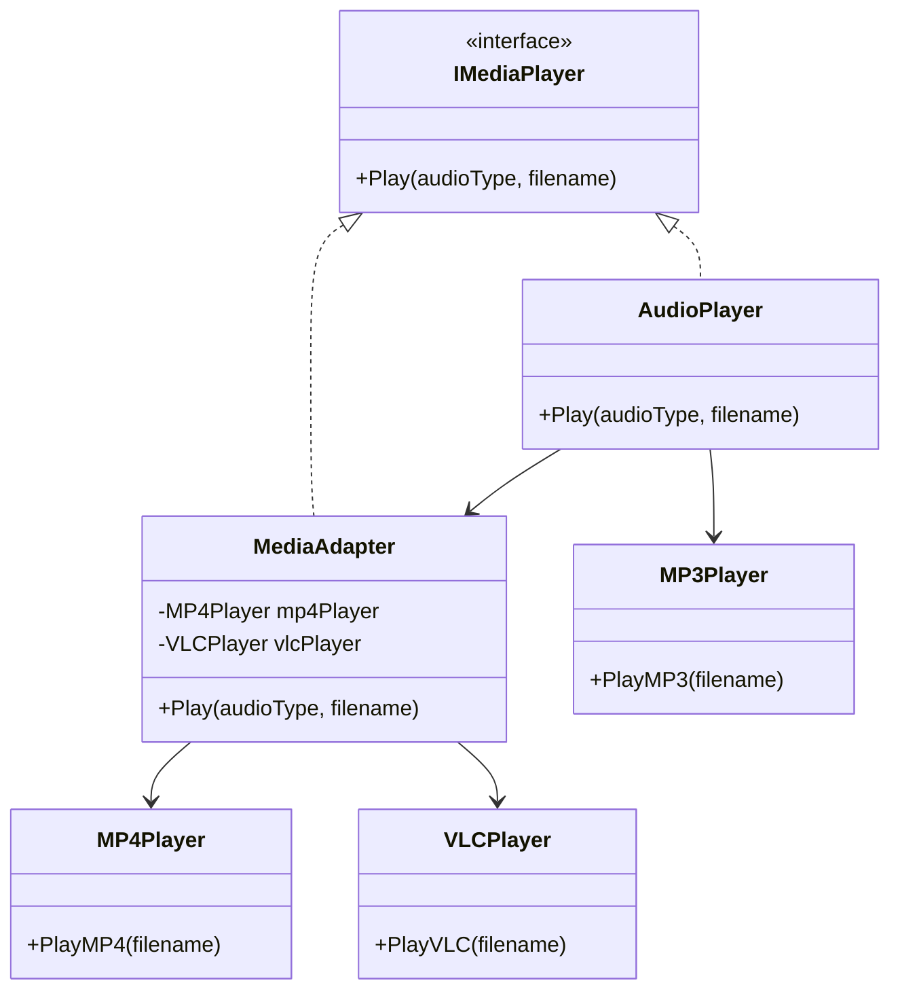

# الگوی Adapter (آداپتور / تبدیل‌گر)

## 🎯 هدف
الگوی Adapter یک الگوی طراحی ساختاری است که به اشیاء با رابط‌های ناسازگار اجازه می‌دهد با هم همکاری کنند.

## 🤔 مشکل
تصور کنید برنامه‌ای برای نمایش داده‌های بازار سهام دارید. برنامه شما داده‌ها را از منابع مختلف به فرمت XML دانلود می‌کند و نمودارها و دیاگرام‌های زیبایی نمایش می‌دهد.

در یک مرحله، تصمیم می‌گیرید برنامه را با یک کتابخانه تحلیل شخص ثالث هوشمند بهبود دهید. اما مشکلی وجود دارد: کتابخانه تحلیل فقط با داده به فرمت JSON کار می‌کند.

شما نمی‌توانید مستقیماً از کتابخانه تحلیل استفاده کنید زیرا فرمت داده انتظار دارد که با فرمت برنامه شما سازگار نیست.

## 💡 راه‌حل
می‌توانید یک آداپتور ایجاد کنید. این یک شیء ویژه است که یک رابط یک شیء را به گونه‌ای تبدیل می‌کند که شیء دیگر بتواند آن را درک کند.

آداپتور یکی از اشیاء را می‌پوشاند تا پیچیدگی تبدیل را پنهان کند. شیء پوشش داده شده حتی از آداپتور اطلاعی ندارد.

## 🏗️ ساختار

```
   ┌──────────┐                  ┌──────────────┐
   │  Client  │─────uses────────▶│    Target    │
   └──────────┘                  │  (Interface) │
                                 ├──────────────┤
                                 │ + request()  │
                                 └──────────────┘
                                         △
                                         │ implements
                                         │
                                 ┌───────────────┐
                                 │    Adapter    │
                                 ├───────────────┤
                                 │ - adaptee     │
                                 │ + request()   │
                                 └───────────────┘
                                         │
                                         │ uses
                                         ↓
                                 ┌───────────────────┐
                                 │     Adaptee       │
                                 ├───────────────────┤
                                 │+ specificRequest()│
                                 └───────────────────┘
```

## 👥 شرکت‌کنندگان

1. **Client**: کلاسی که از رابط Target استفاده می‌کند
2. **Target**: رابطی که Client استفاده می‌کند
3. **Adapter**: رابط Target را به Adaptee تبدیل می‌کند
4. **Adaptee**: کلاسی با رابط ناسازگار که نیاز به تطبیق دارد

## ⚖️ پیامدها

### مزایا ✅
- **اصل تک مسئولیتی**: می‌توانید رابط را از منطق تجاری جدا کنید
- **اصل باز/بسته**: می‌توانید آداپتورهای جدید بدون شکستن کد موجود اضافه کنید
- **افزایش قابلیت استفاده مجدد**: می‌توانید از کلاس‌های موجود با رابط‌های متفاوت استفاده کنید

### معایب ❌
- پیچیدگی کلی کد افزایش می‌یابد

## 💻 مثال کد (C#)

```csharp
using System;

// رابط Target - رابط مورد انتظار
public interface IMediaPlayer
{
    void Play(string audioType, string filename);
}

// Adaptee 1 - کلاس موجود با رابط متفاوت
public class MP3Player
{
    public void PlayMP3(string filename)
    {
        Console.WriteLine($"🎵 پخش فایل MP3: {filename}");
    }
}

// Adaptee 2
public class MP4Player
{
    public void PlayMP4(string filename)
    {
        Console.WriteLine($"🎬 پخش فایل MP4: {filename}");
    }
}

// Adaptee 3
public class VLCPlayer
{
    public void PlayVLC(string filename)
    {
        Console.WriteLine($"📀 پخش فایل VLC: {filename}");
    }
}

// Adapter - تبدیل کننده
public class MediaAdapter : IMediaPlayer
{
    private readonly MP4Player _mp4Player;
    private readonly VLCPlayer _vlcPlayer;

    public MediaAdapter(string audioType)
    {
        if (audioType.Equals("mp4", StringComparison.OrdinalIgnoreCase))
        {
            _mp4Player = new MP4Player();
        }
        else if (audioType.Equals("vlc", StringComparison.OrdinalIgnoreCase))
        {
            _vlcPlayer = new VLCPlayer();
        }
    }

    public void Play(string audioType, string filename)
    {
        if (audioType.Equals("mp4", StringComparison.OrdinalIgnoreCase))
        {
            _mp4Player.PlayMP4(filename);
        }
        else if (audioType.Equals("vlc", StringComparison.OrdinalIgnoreCase))
        {
            _vlcPlayer.PlayVLC(filename);
        }
    }
}

// Client - پخش‌کننده صوتی
public class AudioPlayer : IMediaPlayer
{
    public void Play(string audioType, string filename)
    {
        // پخش داخلی MP3
        if (audioType.Equals("mp3", StringComparison.OrdinalIgnoreCase))
        {
            MP3Player mp3Player = new MP3Player();
            mp3Player.PlayMP3(filename);
        }
        // استفاده از آداپتور برای فرمت‌های دیگر
        else if (audioType.Equals("mp4", StringComparison.OrdinalIgnoreCase) || 
                 audioType.Equals("vlc", StringComparison.OrdinalIgnoreCase))
        {
            MediaAdapter adapter = new MediaAdapter(audioType);
            adapter.Play(audioType, filename);
        }
        else
        {
            Console.WriteLine($"❌ فرمت {audioType} پشتیبانی نمی‌شود");
        }
    }
}

// استفاده از الگو
class Program
{
    static void Main()
    {
        Console.WriteLine("🎧 الگوی Adapter - پخش‌کننده صوتی\n");
        Console.WriteLine(new string('=', 60));

        AudioPlayer player = new AudioPlayer();

        Console.WriteLine("\n📀 پخش فایل‌های مختلف:");
        Console.WriteLine(new string('-', 60));
        player.Play("mp3", "آهنگ_محلی.mp3");
        player.Play("mp4", "ویدیو_موزیک.mp4");
        player.Play("vlc", "فیلم.vlc");
        player.Play("avi", "فیلم.avi");
    }
}

/* خروجی:
🎧 الگوی Adapter - پخش‌کننده صوتی

============================================================

📀 پخش فایل‌های مختلف:
------------------------------------------------------------
🎵 پخش فایل MP3: آهنگ_محلی.mp3
🎬 پخش فایل MP4: ویدیو_موزیک.mp4
📀 پخش فایل VLC: فیلم.vlc
❌ فرمت avi پشتیبانی نمی‌شود
*/
```

## 🎯 کاربردهای واقعی

1. **سیستم‌های قدیمی (Legacy)**: یکپارچه‌سازی کد قدیمی با معماری جدید
2. **کتابخانه‌های Third-party**: استفاده از کتابخانه‌هایی با رابط متفاوت
3. **تبدیل داده**: تبدیل بین فرمت‌های مختلف (XML ↔ JSON)
4. **Device Drivers**: تطبیق سخت‌افزارهای مختلف با رابط یکسان
5. **پخش‌کننده‌های رسانه**: پشتیبانی از فرمت‌های مختلف
6. **API Wrappers**: پوشش دادن API های مختلف با یک رابط یکسان

## 📊 نمودار کلاس



## 🔍 چه زمانی استفاده کنیم؟

1. **رابط ناسازگار**: کلاس موجود رابط مناسبی ندارد ولی نمی‌توانیم آن را تغییر دهیم
2. **استفاده مجدد**: چندین کلاس زیر با رابط‌های مختلف دارید که می‌خواهید یکسان کنید
3. **کتابخانه‌های Third-party**: یکپارچه‌سازی کتابخانه‌های خارجی
4. **Legacy Systems**: کار با سیستم‌های قدیمی بدون تغییر کد آنها
5. **پلاگین‌ها**: ایجاد سیستم پلاگین با رابط یکسان

## ✅ مزایا

- **استفاده مجدد**: امکان استفاده از کلاس‌های موجود
- **اصل تک مسئولیتی**: جداسازی تبدیل رابط از منطق تجاری
- **اصل Open/Closed**: اضافه کردن Adapter های جدید بدون تغییر کد موجود
- **انعطاف‌پذیری**: تطبیق کلاس‌های مختلف با یک رابط

## ❌ معایب

- **پیچیدگی**: اضافه شدن کلاس‌ها و رابط‌های جدید
- **گاهی بهتر است**: کد مبدأ را مستقیماً تغییر دهید (اگر امکان دارد)

## 🔑 نکات کلیدی

- Adapter دو نوع دارد: **Object Adapter** (استفاده از Composition) و **Class Adapter** (استفاده از Inheritance)
- در C# معمولاً از Object Adapter استفاده می‌شود
- Adapter فقط رابط را تغییر می‌دهد، نه رفتار
- می‌تواند دو طرفه باشد (Two-way Adapter)

---

> **یادآوری**: Adapter مانند یک مترجم عمل می‌کند و به اشیاء با رابط‌های مختلف اجازه می‌دهد با هم ارتباط برقرار کنند! 🔌
