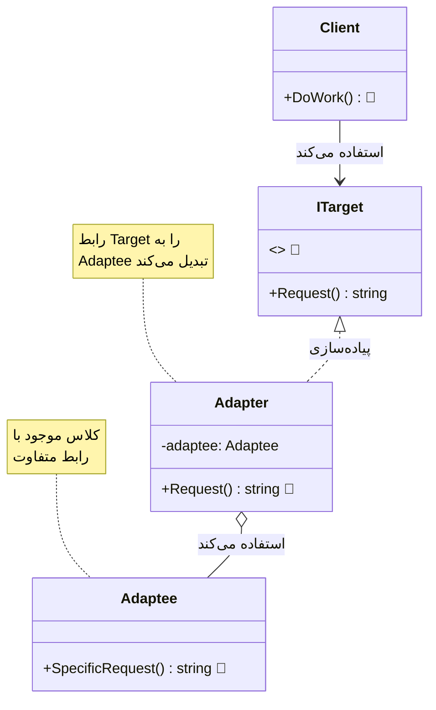
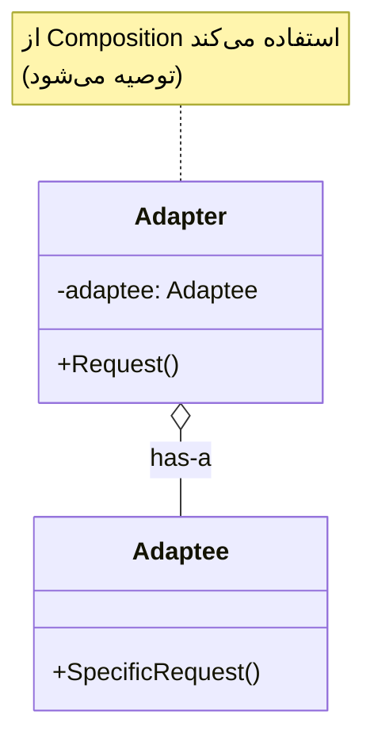
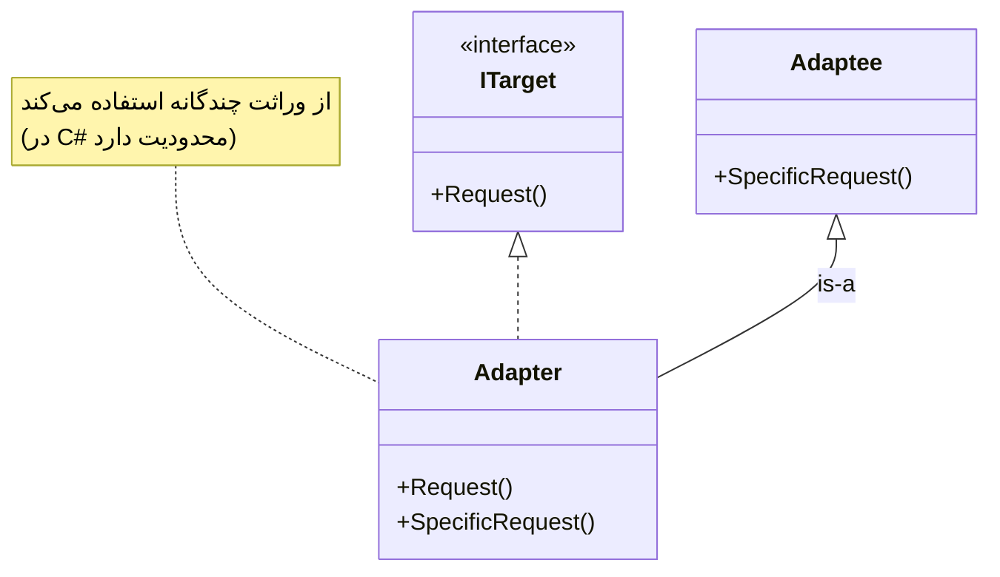
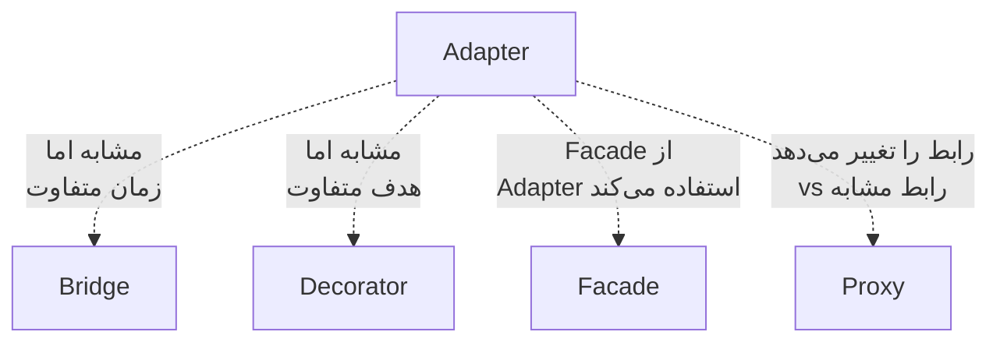

# 🔌 الگوی Adapter (آداپتور / تبدیل‌گر)

## 🎯 هدف

الگوی **Adapter** یک الگوی طراحی ساختاری (Structural) است که **به اشیاء با رابط‌های ناسازگار اجازه می‌دهد با هم همکاری کنند**. این الگو مانند یک مترجم عمل می‌کند که بین دو سیستم با زبان‌های متفاوت ارتباط برقرار می‌کند.

به زبان ساده‌تر، Adapter مانند **تبدیل برق** است! وقتی می‌خواهید دستگاه ایرانی (220 ولت) را در آمریکا (110 ولت) استفاده کنید، به یک آداپتور نیاز دارید. در برنامه‌نویسی هم، وقتی دو کلاس رابط‌های متفاوتی دارند، از Adapter استفاده می‌کنیم تا آن‌ها را به هم متصل کنیم.

## 🤔 مشکل

تصور کنید در حال توسعه یک برنامه **نمایش داده‌های بورس** هستید. برنامه شما داده‌ها را از منابع مختلف به فرمت **XML** دریافت می‌کند و نمودارهای زیبایی نمایش می‌دهد.

```csharp
// کد موجود شما
public class StockMarketApp
{
    public void DisplayData(XmlData data)
    {
        // پردازش و نمایش داده XML
    }
}
```

حالا می‌خواهید از یک **کتابخانه تحلیل پیشرفته شخص ثالث** استفاده کنید که ویژگی‌های فوق‌العاده‌ای دارد. اما مشکل:

```csharp
// کتابخانه شخص ثالث
public class AdvancedAnalytics
{
    public void Analyze(JsonData data) // فقط JSON می‌پذیرد! ❌
    {
        // تحلیل پیشرفته...
    }
}
```

### مشکلات:

1. **رابط ناسازگار**: کتابخانه JSON می‌خواهد، برنامه شما XML دارد
2. **نمی‌توانید کد کتابخانه را تغییر دهید**: شخص ثالث است!
3. **نمی‌خواهید کل کد خود را تغییر دهید**: خیلی کار است!
4. **ممکن است چند کتابخانه ناسازگار داشته باشید**: هر کدام فرمت متفاوت

**نتیجه**: دو قطعه عالی دارید که نمی‌توانند با هم کار کنند! 😢

## 💡 راه‌حل

الگوی Adapter این مشکل را با ایجاد یک **لایه واسط** حل می‌کند:

```csharp
// آداپتور: XML را به JSON تبدیل می‌کند
public class XmlToJsonAdapter : IAnalytics
{
    private AdvancedAnalytics _analytics = new();
    
    public void Analyze(XmlData xmlData)
    {
        // 1. XML را به JSON تبدیل کن
        JsonData jsonData = ConvertXmlToJson(xmlData);
        
        // 2. کتابخانه شخص ثالث را صدا بزن
        _analytics.Analyze(jsonData);
    }
}

// حالا می‌توانید استفاده کنید! ✨
IAnalytics analytics = new XmlToJsonAdapter();
analytics.Analyze(xmlData); // کار می‌کند!
```

**مزایا:**
- ✅ کد موجود تغییر نمی‌کند
- ✅ کتابخانه شخص ثالث تغییر نمی‌کند
- ✅ انعطاف‌پذیری کامل
- ✅ می‌توانید چند آداپتور داشته باشید

## 📊 ساختار



### دو نوع Adapter:

#### 1. Object Adapter (ترکیب - Composition)


#### 2. Class Adapter (وراثت - Inheritance)


## 💻 پیاده‌سازی با C#

### مثال 1: سیستم پرداخت

```csharp
// رابط مورد انتظار سیستم ما
public interface IPaymentProcessor
{
    void ProcessPayment(decimal amount, string currency);
    bool ValidatePayment();
}

// پیاده‌سازی داخلی ما
public class InternalPaymentProcessor : IPaymentProcessor
{
    public void ProcessPayment(decimal amount, string currency)
    {
        Console.WriteLine($"💳 پرداخت داخلی: {amount} {currency}");
    }
    
    public bool ValidatePayment() => true;
}

// کتابخانه شخص ثالث با رابط متفاوت
public class PayPalService
{
    public void MakePayment(double amountInDollars)
    {
        Console.WriteLine($"🌐 PayPal: ${amountInDollars} پرداخت شد");
    }
    
    public bool CheckAccount()
    {
        Console.WriteLine("✅ حساب PayPal تایید شد");
        return true;
    }
}

// Adapter: PayPal را به رابط ما متصل می‌کند
public class PayPalAdapter : IPaymentProcessor
{
    private readonly PayPalService _payPal;
    
    public PayPalAdapter(PayPalService payPal)
    {
        _payPal = payPal;
    }
    
    public void ProcessPayment(decimal amount, string currency)
    {
        // تبدیل به دلار (اگر لازم باشد)
        double amountInDollars = currency == "USD" 
            ? (double)amount 
            : (double)amount / 42000; // تبدیل تومان به دلار
        
        _payPal.MakePayment(amountInDollars);
    }
    
    public bool ValidatePayment()
    {
        return _payPal.CheckAccount();
    }
}

// استفاده
class Program
{
    static void Main()
    {
        // سیستم پرداخت داخلی
        IPaymentProcessor internal = new InternalPaymentProcessor();
        internal.ProcessPayment(1000000, "IRR");
        
        // PayPal از طریق Adapter
        IPaymentProcessor paypal = new PayPalAdapter(new PayPalService());
        paypal.ProcessPayment(1000000, "IRR");
        paypal.ValidatePayment();
    }
}
```

### خروجی:
```
💳 پرداخت داخلی: 1000000 IRR
🌐 PayPal: $23.81 پرداخت شد
✅ حساب PayPal تایید شد
```

### مثال 2: سیستم Logger

```csharp
// رابط Logger استاندارد ما
public interface ILogger
{
    void Log(string message, LogLevel level);
}

public enum LogLevel { Info, Warning, Error }

// کتابخانه قدیمی با رابط متفاوت
public class LegacyLogger
{
    public void WriteLog(int severity, string text)
    {
        Console.WriteLine($"[Legacy] Severity {severity}: {text}");
    }
}

// Adapter
public class LegacyLoggerAdapter : ILogger
{
    private readonly LegacyLogger _legacyLogger;
    
    public LegacyLoggerAdapter(LegacyLogger legacyLogger)
    {
        _legacyLogger = legacyLogger;
    }
    
    public void Log(string message, LogLevel level)
    {
        // تبدیل LogLevel به severity number
        int severity = level switch
        {
            LogLevel.Info => 1,
            LogLevel.Warning => 2,
            LogLevel.Error => 3,
            _ => 0
        };
        
        _legacyLogger.WriteLog(severity, message);
    }
}

// استفاده
ILogger logger = new LegacyLoggerAdapter(new LegacyLogger());
logger.Log("سیستم راه‌اندازی شد", LogLevel.Info);
logger.Log("حافظه کم است", LogLevel.Warning);
logger.Log("خطای دیتابیس", LogLevel.Error);
```

## 🎯 مثال کاربردی: تبدیل فرمت داده

```csharp
// رابط مورد انتظار
public interface IDataProvider
{
    List<Customer> GetCustomers();
}

public class Customer
{
    public int Id { get; set; }
    public string Name { get; set; }
    public string Email { get; set; }
}

// سرویس قدیمی که CSV برمی‌گرداند
public class CsvDataService
{
    public string GetCustomersAsCsv()
    {
        return "1,علی,ali@email.com\n2,رضا,reza@email.com\n3,مریم,maryam@email.com";
    }
}

// Adapter: CSV را به List<Customer> تبدیل می‌کند
public class CsvToCustomerAdapter : IDataProvider
{
    private readonly CsvDataService _csvService;
    
    public CsvToCustomerAdapter(CsvDataService csvService)
    {
        _csvService = csvService;
    }
    
    public List<Customer> GetCustomers()
    {
        string csv = _csvService.GetCustomersAsCsv();
        var customers = new List<Customer>();
        
        foreach (var line in csv.Split('\n'))
        {
            var parts = line.Split(',');
            customers.Add(new Customer
            {
                Id = int.Parse(parts[0]),
                Name = parts[1],
                Email = parts[2]
            });
        }
        
        return customers;
    }
}

// استفاده
IDataProvider provider = new CsvToCustomerAdapter(new CsvDataService());
var customers = provider.GetCustomers();

foreach (var customer in customers)
{
    Console.WriteLine($"👤 {customer.Name} - {customer.Email}");
}
```

## ⚖️ مزایا و معایب

### مزایا ✅

1. **اصل تک مسئولیتی (SRP)**: منطق تبدیل از کد کسب‌وکار جدا است
2. **اصل باز/بسته (OCP)**: می‌توانید Adapter های جدید بدون تغییر کد موجود اضافه کنید
3. **استفاده مجدد**: کدهای قدیمی یا شخص ثالث را بدون تغییر استفاده کنید
4. **انعطاف‌پذیری**: چندین Adapter برای چندین Adaptee
5. **جداسازی**: Client از جزئیات Adaptee بی‌اطلاع است
6. **یکپارچگی**: سیستم‌های مختلف را به هم متصل کنید

### معایب ❌

1. **پیچیدگی کد**: کلاس‌های اضافی ایجاد می‌شود
2. **Performance**: یک لایه اضافی در فراخوانی‌ها
3. **ممکن است ساده‌تر باشد**: گاهی تغییر مستقیم کد ساده‌تر است
4. **نگهداری**: باید هم Client و هم Adaptee را نگهداری کنید

## 🔍 چه زمانی استفاده کنیم؟

### ✅ استفاده کنید وقتی:

1. **کلاس موجود استفاده می‌کنید**: اما رابط آن با کد شما سازگار نیست
2. **کتابخانه شخص ثالث**: نمی‌توانید کد آن را تغییر دهید
3. **کدهای قدیمی (Legacy)**: می‌خواهید کد قدیمی را با سیستم جدید ادغام کنید
4. **چندین کلاس مشابه**: با رابط‌های متفاوت که می‌خواهید یکسان کنید
5. **Middleware**: نیاز به لایه واسط بین دو سیستم
6. **یکپارچه‌سازی**: اتصال سیستم‌های مختلف

### ❌ استفاده نکنید وقتی:

1. **می‌توانید رابط را تغییر دهید**: بهتر است مستقیماً رابط را اصلاح کنید
2. **فقط یک جا استفاده می‌شود**: پیچیدگی اضافی توجیه ندارد
3. **Performance حیاتی است**: Adapter یک لایه اضافی ایجاد می‌کند
4. **تبدیل بسیار پیچیده**: شاید الگوی دیگری مناسب‌تر باشد

## 🎯 کاربردهای واقعی

1. **Data Access Layer**: تبدیل بین ORM های مختلف
2. **Third-Party Libraries**: ادغام کتابخانه‌های خارجی
3. **Legacy Code Integration**: اتصال کدهای قدیمی به سیستم‌های جدید
4. **API Wrapper**: پوشش دادن API های external
5. **Database Adapters**: ADO.NET Providers برای DB های مختلف
6. **UI Frameworks**: تبدیل بین framework های مختلف
7. **Logging Systems**: یکپارچه‌سازی logger های مختلف
8. **Payment Gateways**: اتصال درگاه‌های پرداخت مختلف

## 💡 نکات پیاده‌سازی و Best Practices

### 1. ترجیح Composition بر Inheritance

```csharp
// ✅ خوب - Object Adapter با Composition
public class GoodAdapter : ITarget
{
    private readonly Adaptee _adaptee;
    public GoodAdapter(Adaptee adaptee) => _adaptee = adaptee;
}

// ❌ بد - Class Adapter با Inheritance (در C# محدود است)
public class BadAdapter : Adaptee, ITarget
{
    // مشکل: فقط یک کلاس می‌توان ارث برد
}
```

### 2. استفاده از Dependency Injection

```csharp
// در ASP.NET Core
services.AddScoped<IPaymentProcessor, PayPalAdapter>();
services.AddSingleton<PayPalService>();
```

### 3. Adapter Chain (زنجیره Adapter ها)

```csharp
// می‌توانید چند Adapter را به هم زنجیر کنید
ITarget adapter = new AdapterB(new AdapterA(new Adaptee()));
```

### 4. Two-Way Adapter (دوطرفه)

```csharp
public class TwoWayAdapter : ITarget, IAdaptee
{
    public void TargetMethod() => AdapteeMethod();
    public void AdapteeMethod() => TargetMethod();
}
```

### 5. Caching در Adapter

```csharp
public class CachedAdapter : ITarget
{
    private readonly Adaptee _adaptee;
    private string _cachedResult;
    
    public string Request()
    {
        return _cachedResult ??= _adaptee.SpecificRequest();
    }
}
```

## 🆚 مقایسه با الگوهای مشابه

| ویژگی | Adapter | Bridge | Decorator | Facade |
|-------|---------|---------|-----------|--------|
| هدف | **تبدیل** رابط | **جدا کردن** abstraction | **افزودن** قابلیت | **ساده‌سازی** |
| زمان | **بعد** از طراحی | **قبل** از طراحی | هر زمان | هر زمان |
| ساختار | رابط را تغییر می‌دهد | دو سلسله‌مراتب | رابط را حفظ می‌کند | یک رابط ساده |
| کاربرد | سازگاری | انعطاف | ویژگی جدید | یکپارچه‌سازی |

## 📚 ارتباط با الگوهای دیگر



### روابط:

- **Bridge**: مشابه Adapter اما در زمان طراحی، نه بعد از آن
- **Decorator**: رابط را تغییر نمی‌دهد، فقط قابلیت اضافه می‌کند
- **Facade**: ساده‌سازی می‌کند، نه تبدیل
- **Proxy**: رابط مشابه، اما کنترل دسترسی می‌کند

## 🔑 نکات کلیدی

> **💡 یادآوری مهم**:
>
> **Adapter = اتصال‌دهنده دو سیستم ناسازگار**
>
> زمانی از Adapter استفاده کنید که:
> - ✅ کد موجود نمی‌توانید تغییر دهید
> - ✅ رابط‌ها ناسازگار هستند
> - ✅ می‌خواهید کدهای مختلف را یکپارچه کنید
>
> Adapter **بعد از طراحی** استفاده می‌شود تا مشکل **سازگاری** را حل کند.

## ⚠️ اشتباهات رایج

### 1. Adapter خیلی پیچیده

```csharp
// ❌ بد - Adapter نباید منطق کسب‌وکار داشته باشد
public class BadAdapter : ITarget
{
    public void Request()
    {
        // منطق کسب‌وکار پیچیده ❌
        if (complexBusinessLogic)
        {
            // ...
        }
        _adaptee.SpecificRequest();
    }
}

// ✅ خوب - فقط تبدیل
public class GoodAdapter : ITarget
{
    public void Request()
    {
        // فقط تبدیل ساده
        _adaptee.SpecificRequest();
    }
}
```

### 2. استفاده نادرست از Class Adapter

```csharp
// ❌ بد - در C# محدودیت وراثت چندگانه
// استفاده از Object Adapter بهتر است
```

### 3. فراموش کردن Exception Handling

```csharp
// ✅ خوب - مدیریت خطا
public class SafeAdapter : ITarget
{
    public void Request()
    {
        try
        {
            _adaptee.SpecificRequest();
        }
        catch (AdapteeException ex)
        {
            throw new TargetException("خطا در Adapter", ex);
        }
    }
}
```

## 🎯 خلاصه

Adapter یک الگوی ساده اما قدرتمند است که:
- ✅ **سازگاری** بین رابط‌های مختلف ایجاد می‌کند
- ✅ **استفاده مجدد** از کدهای موجود بدون تغییر
- ✅ **یکپارچه‌سازی** سیستم‌های مختلف
- ✅ **انعطاف‌پذیری** در ادغام کتابخانه‌های شخص ثالث

استفاده کنید برای:
- ✅ کتابخانه‌های شخص ثالث
- ✅ کدهای قدیمی (Legacy)
- ✅ API های external
- ✅ یکپارچه‌سازی سیستم‌ها

---

**[🏠 بازگشت به صفحه اصلی](../index.html)**
