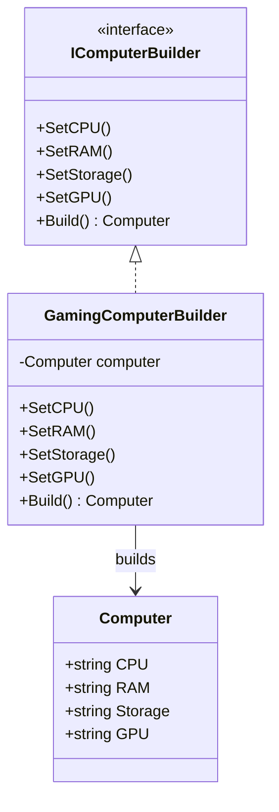

# 👷 الگوی سازنده (Builder)

## 🎯 هدف

ساخت گام‌به‌گام اشیاء پیچیده با جداسازی ساخت از نمایش

## 🤔 مشکل

ساخت اشیاء با پارامترهای زیاد یا پیکربندی پیچیده دشوار و خطاپذیر است

## 📊 ساختار



## 💻 پیاده‌سازی با C#

```csharp
public class Computer
{
    public string CPU { get; set; }
    public string RAM { get; set; }
    public string Storage { get; set; }
    public string GPU { get; set; }

    public override string ToString()
    {
        return $"💻 Computer: CPU={CPU}, RAM={RAM}, Storage={Storage}, GPU={GPU}";
    }
}

public interface IComputerBuilder
{
    IComputerBuilder SetCPU(string cpu);
    IComputerBuilder SetRAM(string ram);
    IComputerBuilder SetStorage(string storage);
    IComputerBuilder SetGPU(string gpu);
    Computer Build();
}

public class GamingComputerBuilder : IComputerBuilder
{
    private Computer _computer = new Computer();

    public IComputerBuilder SetCPU(string cpu)
    {
        _computer.CPU = cpu;
        return this;
    }

    public IComputerBuilder SetRAM(string ram)
    {
        _computer.RAM = ram;
        return this;
    }

    public IComputerBuilder SetStorage(string storage)
    {
        _computer.Storage = storage;
        return this;
    }

    public IComputerBuilder SetGPU(string gpu)
    {
        _computer.GPU = gpu;
        return this;
    }

    public Computer Build()
    {
        return _computer;
    }
}

// استفاده
var computer = new GamingComputerBuilder()
    .SetCPU("Intel i9-13900K")
    .SetRAM("32GB DDR5")
    .SetStorage("2TB NVMe SSD")
    .SetGPU("RTX 4090")
    .Build();

Console.WriteLine(computer);
```

## ⚖️ مزایا و معایب

### مزایا ✅
- کد تمیز و قابل نگهداری
- انعطاف‌پذیری بالا
- قابلیت توسعه

### معایب ❌
- پیچیدگی اولیه
- کد بیشتر

## 🔍 چه زمانی استفاده کنیم؟

این الگو را زمانی به کار ببرید که نیاز به انعطاف‌پذیری و توسعه‌پذیری دارید.

---

**[🏠 بازگشت به صفحه اصلی](../index.html)**
