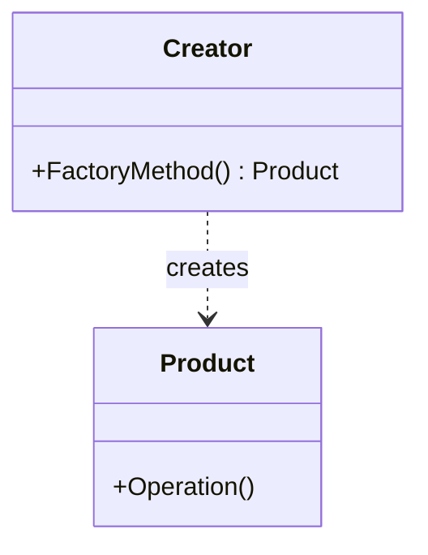

# 🤝 راهنمای مشارکت در پروژه الگوهای طراحی

سلام و ممنون از اینکه وقت خود را برای بهبود این پروژه اختصاص می‌دهید! 🎉

این راهنما به شما کمک می‌کند تا بهترین روش مشارکت در پروژه را بیاموزید.

## 📋 فهرست مطالب

- [چگونه می‌توانم کمک کنم؟](#چگونه-میتوانم-کمک-کنم)
- [گزارش مشکلات](#گزارش-مشکلات)
- [پیشنهاد ویژگی جدید](#پیشنهاد-ویژگی-جدید)
- [مراحل ارسال Pull Request](#مراحل-ارسال-pull-request)
- [استانداردهای کدنویسی](#استانداردهای-کدنویسی)
- [استانداردهای محتوا](#استانداردهای-محتوا)
- [نکات مهم](#نکات-مهم)

---

## چگونه می‌توانم کمک کنم؟

راه‌های مختلفی برای کمک به این پروژه وجود دارد:

### 📝 بهبود محتوا
- اضافه کردن توضیحات بیشتر به الگوهای موجود
- بهبود مثال‌های عملی و سناریوهای واقعی
- اصلاح املا و گرامر فارسی
- بهبود ترجمه اصطلاحات تخصصی

### 💻 بهبود کد
- اضافه کردن مثال‌های جدید به C#
- بهبود کیفیت کدهای موجود
- اضافه کردن مثال‌ها به زبان‌های برنامه‌نویسی دیگر (Java, Python, JavaScript, و...)
- رفع باگ‌های کد

### 🎨 بهبود طراحی
- بهبود طراحی صفحات HTML
- اضافه کردن نمودارهای جدید Mermaid.js
- بهبود تجربه کاربری (UX)
- پشتیبانی بهتر از دستگاه‌های موبایل

### 📚 مستندسازی
- اضافه کردن توضیحات بیشتر به README
- ایجاد آموزش‌های ویدیویی
- نوشتن مقالات توضیحی
- ترجمه به زبان‌های دیگر

### 🐛 گزارش مشکلات
- یافتن و گزارش باگ‌ها
- گزارش مشکلات محتوایی
- پیشنهاد بهبودها

---

## گزارش مشکلات

قبل از گزارش مشکل جدید:

1. ✅ **جستجو کنید**: اطمینان حاصل کنید که مشکل قبلاً گزارش نشده است
2. ✅ **مشخص باشید**: مشکل را با جزئیات کامل توضیح دهید
3. ✅ **اسکرین‌شات**: در صورت امکان تصویر از مشکل ضمیمه کنید
4. ✅ **محیط**: اطلاعات سیستم عامل، مرورگر، و ورژن را ذکر کنید

### الگوی گزارش مشکل

از الگوی Issue Template پروژه استفاده کنید که شامل:
- عنوان واضح و مختصر
- توضیحات دقیق مشکل
- مراحل بازتولید مشکل
- رفتار مورد انتظار در مقابل رفتار واقعی
- اطلاعات محیط (مرورگر، سیستم عامل، و...)
- تصاویر و لاگ‌های مرتبط

---

## پیشنهاد ویژگی جدید

برای پیشنهاد ویژگی جدید:

1. 🔍 **تحقیق کنید**: بررسی کنید که آیا این ویژگی قبلاً پیشنهاد شده یا نه
2. 💡 **توضیح دهید**: دلیل نیاز به این ویژگی را شرح دهید
3. 📝 **جزئیات**: نحوه پیاده‌سازی پیشنهادی را توضیح دهید
4. 🎯 **مثال**: مثال‌های عملی از کاربرد ارائه دهید

یک Issue جدید با برچسب `enhancement` ایجاد کنید و پیشنهاد خود را با جزئیات کامل شرح دهید.

---

## مراحل ارسال Pull Request

### 1️⃣ Fork و Clone

```bash
# Fork کردن پروژه از صفحه GitHub
# سپس clone کردن fork شما
git clone https://github.com/YOUR-USERNAME/الگوهای-طراحی-فارسی.git
cd الگوهای-طراحی-فارسی
```

### 2️⃣ ایجاد Branch جدید

```bash
# برای هر تغییر یک branch جدید ایجاد کنید
git checkout -b feature/my-improvement

# یا برای رفع باگ
git checkout -b fix/issue-description
```

نام‌گذاری branch:
- `feature/` برای ویژگی‌های جدید
- `fix/` برای رفع باگ
- `docs/` برای تغییرات مستندات
- `style/` برای تغییرات ظاهری

### 3️⃣ انجام تغییرات

- کدهای خود را بنویسید
- محتوای خود را اضافه کنید
- فایل‌های مربوطه را بروزرسانی کنید

### 4️⃣ تست کردن

قبل از commit:
- ✅ فایل‌های HTML را در مرورگر باز کنید و تست کنید
- ✅ کدهای C# را کامپایل و اجرا کنید
- ✅ نمودارهای Mermaid را بررسی کنید
- ✅ املا و گرامر را چک کنید
- ✅ لینک‌ها را تست کنید

### 5️⃣ Commit کردن

```bash
git add .
git commit -m "نوع تغییر: توضیح مختصر تغییرات"
```

قالب پیام commit:
- `feat: اضافه کردن مثال جدید برای الگوی Factory`
- `fix: رفع مشکل نمایش نمودار در Singleton`
- `docs: بهبود توضیحات الگوی Builder`
- `style: بهبود طراحی صفحه اصلی`

### 6️⃣ Push کردن

```bash
git push origin feature/my-improvement
```

### 7️⃣ ایجاد Pull Request

1. به صفحه repository اصلی در GitHub بروید
2. روی "Pull Request" کلیک کنید
3. "New Pull Request" را انتخاب کنید
4. branch خود را انتخاب کنید
5. عنوان و توضیحات کامل را وارد کنید (از Template استفاده کنید)
6. منتظر بررسی باشید! 🎉

---

## استانداردهای کدنویسی

### کدهای C#

```csharp
// از نام‌گذاری استاندارد C# استفاده کنید
public class FactoryMethod  // PascalCase برای کلاس‌ها
{
    private string _name;   // camelCase با _ برای فیلدهای private
    
    public string Name      // PascalCase برای Property
    { 
        get => _name; 
        set => _name = value; 
    }
    
    public void CreateProduct()  // PascalCase برای متدها
    {
        // کد با فاصله‌گذاری مناسب و تمیز
        var product = new Product();
        return product;
    }
}
```

### قوانین کدنویسی
- ✅ از نام‌های فارسی در کامنت‌ها استفاده کنید
- ✅ کد را تمیز و خوانا نگه دارید
- ✅ از اصول SOLID پیروی کنید
- ✅ کامنت‌های توضیحی برای بخش‌های پیچیده بنویسید
- ✅ از نام‌های معنادار برای متغیرها استفاده کنید

---

## استانداردهای محتوا

### زبان فارسی
- ✅ از فارسی **روان و طبیعی** استفاده کنید
- ✅ از املای صحیح استفاده کنید (از ابزارهای ویراستاری کمک بگیرید)
- ✅ از علائم نگارشی صحیح استفاده کنید
- ✅ اصطلاحات تخصصی را به فارسی ترجمه کنید (در صورت امکان)
- ✅ معادل فارسی مناسب برای واژه‌های انگلیسی انتخاب کنید

### ساختار README

هر الگو باید شامل این بخش‌ها باشد:

```markdown
# 🔧 نام الگو (English Name)

## 📖 توضیحات
توضیح کامل و روان الگو

## ❓ چه مشکلی را حل می‌کند؟
شرح مشکل به زبان ساده

## 🎯 کاربردها
موارد استفاده واقعی

## ⚙️ پیاده‌سازی
کد C# با توضیحات

## 🎨 نمودار
نمودار Mermaid.js

## ✅ مزایا و ❌ معایب
نکات مثبت و منفی

## 💡 نکات پیاده‌سازی
نکات عملی

## 🔗 ارتباط با الگوهای دیگر
الگوهای مرتبط
```

### نمودارهای Mermaid

```markdown


- ✅ از رنگ‌بندی مناسب استفاده کنید
- ✅ نمودار را واضح و خوانا نگه دارید
- ✅ از کامنت‌های فارسی در نمودار استفاده کنید

### صفحات HTML

- ✅ از ساختار HTML5 معتبر استفاده کنید
- ✅ Responsive باشد
- ✅ از Dark Mode پشتیبانی کند
- ✅ Accessibility را رعایت کنید
- ✅ سرعت بارگذاری مناسب داشته باشد

---

## نکات مهم

### ✨ کیفیت در اولویت
کیفیت مهم‌تر از کمیت است. یک تغییر کوچک و باکیفیت بهتر از چندین تغییر بی‌کیفیت است.

### 🎯 یک موضوع در هر PR
هر Pull Request باید روی **یک موضوع خاص** تمرکز داشته باشد. PRهای کوچک‌تر راحت‌تر بررسی می‌شوند.

### 📝 توضیحات کافی
در commit message و PR description، تغییرات خود را به طور کامل توضیح دهید.

### 💬 محترمانه باشید
همیشه با احترام و ادب با دیگران تعامل کنید. [قوانین رفتاری](CODE_OF_CONDUCT.md) را رعایت کنید.

### ⏱️ صبور باشید
بررسی PR ممکن است کمی زمان ببرد. صبور باشید و منتظر بازخورد باشید.

### 🔄 آماده تغییرات باشید
ممکن است نیاز به تغییراتی در PR شما باشد. این طبیعی است و بخشی از فرآیند بهبود است.

---

## 📞 ارتباط با ما

سوالی دارید؟ می‌توانید:

- 💬 در [Discussions](../../discussions) سوال بپرسید
- 🐛 در [Issues](../../issues) مشکل گزارش کنید
- 📧 ایمیل بزنید: [contact@example.com](mailto:contact@example.com)

---

## 🙏 تشکر

ممنون از اینکه در بهبود این پروژه مشارکت می‌کنید! هر کمکی، کوچک یا بزرگ، ارزشمند است. 💚

مشارکت شما به توسعه دانش برنامه‌نویسی در جامعه فارسی‌زبان کمک می‌کند. 🚀

---

<div align="center">

**ساخته شده با ❤️ برای جامعه برنامه‌نویسان فارسی‌زبان**

[🏠 بازگشت به صفحه اصلی](README.md)

</div>
