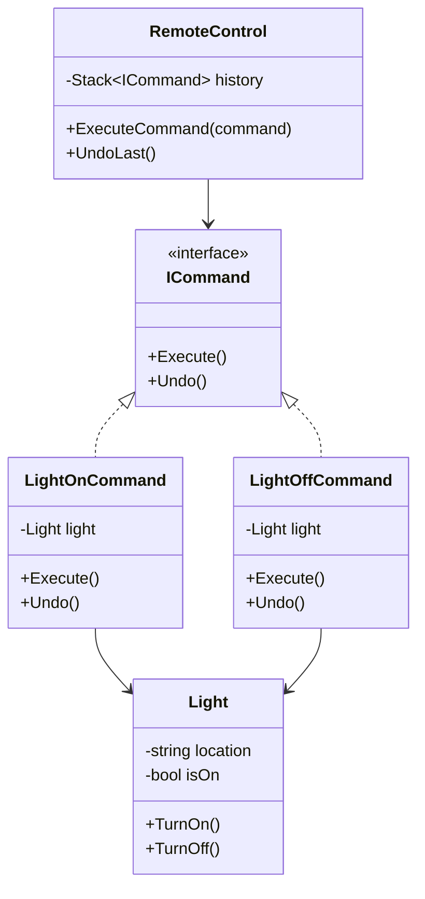

# الگوی Command (فرمان / دستور)

## 🎯 هدف
الگوی Command یک الگوی طراحی رفتاری است که یک درخواست را به عنوان یک شیء مستقل که حاوی تمام اطلاعات درخواست است، تبدیل می‌کند. این تبدیل به شما اجازه می‌دهد درخواست‌ها را پارامتری کنید، اجرای آن‌ها را به تعویق بیندازید، صف کنید و عملیات قابل بازگشت را پشتیبانی کنید.

## 🤔 مشکل
تصور کنید در حال کار روی یک برنامه ویرایشگر متن جدید هستید. وظیفه فعلی شما ایجاد نوار ابزار با دکمه‌هایی برای عملیات مختلف ویرایشگر است. شما یک کلاس `Button` بسیار خوب ایجاد کردید که می‌تواند برای دکمه‌های نوار ابزار و همچنین دکمه‌های عمومی در دیالوگ‌های مختلف استفاده شود.

مشکل اینجاست: کد منطق تجاری را کجا قرار دهیم؟

## 💡 راه‌حل
طراحی نرم‌افزار خوب اغلب بر اساس اصل جداسازی نگرانی‌ها است که معمولاً منجر به تقسیم برنامه به لایه‌ها می‌شود. الگوی Command پیشنهاد می‌کند که اشیاء GUI نباید درخواست‌ها را مستقیماً ارسال کنند. به جای آن، باید تمام جزئیات درخواست را در یک کلاس فرمان جداگانه قرار دهید.

## 💻 مثال کد (C#)

```csharp
using System;
using System.Collections.Generic;

// رابط Command
public interface ICommand
{
    void Execute();
    void Undo();
}

// Receiver - دریافت‌کننده
public class Light
{
    private readonly string _location;
    private bool _isOn;

    public Light(string location)
    {
        _location = location;
        _isOn = false;
    }

    public void TurnOn()
    {
        _isOn = true;
        Console.WriteLine($"💡 چراغ {_location} روشن شد");
    }

    public void TurnOff()
    {
        _isOn = false;
        Console.WriteLine($"💡 چراغ {_location} خاموش شد");
    }
}

// Concrete Command - روشن کردن چراغ
public class LightOnCommand : ICommand
{
    private readonly Light _light;

    public LightOnCommand(Light light)
    {
        _light = light;
    }

    public void Execute()
    {
        _light.TurnOn();
    }

    public void Undo()
    {
        _light.TurnOff();
    }
}

// Concrete Command - خاموش کردن چراغ
public class LightOffCommand : ICommand
{
    private readonly Light _light;

    public LightOffCommand(Light light)
    {
        _light = light;
    }

    public void Execute()
    {
        _light.TurnOff();
    }

    public void Undo()
    {
        _light.TurnOn();
    }
}

// Invoker - فراخواننده
public class RemoteControl
{
    private readonly Stack<ICommand> _history = new();

    public void ExecuteCommand(ICommand command)
    {
        command.Execute();
        _history.Push(command);
    }

    public void UndoLast()
    {
        if (_history.Count > 0)
        {
            ICommand command = _history.Pop();
            command.Undo();
            Console.WriteLine("↩️ عملیات قبلی لغو شد");
        }
        else
        {
            Console.WriteLine("⚠️ تاریخچه‌ای برای بازگشت وجود ندارد");
        }
    }
}

// استفاده از الگو
class Program
{
    static void Main()
    {
        Console.WriteLine("🎮 الگوی Command - کنترل از راه دور\n");

        Light livingRoomLight = new Light("اتاق نشیمن");
        Light bedroomLight = new Light("اتاق خواب");

        LightOnCommand livingOn = new LightOnCommand(livingRoomLight);
        LightOffCommand livingOff = new LightOffCommand(livingRoomLight);
        LightOnCommand bedroomOn = new LightOnCommand(bedroomLight);

        RemoteControl remote = new RemoteControl();

        remote.ExecuteCommand(livingOn);
        remote.ExecuteCommand(bedroomOn);
        remote.ExecuteCommand(livingOff);

        remote.UndoLast();
        remote.UndoLast();
    }
}

/* خروجی:
🎮 الگوی Command - کنترل از راه دور

💡 چراغ اتاق نشیمن روشن شد
💡 چراغ اتاق خواب روشن شد
💡 چراغ اتاق نشیمن خاموش شد
💡 چراغ اتاق نشیمن روشن شد
↩️ عملیات قبلی لغو شد
💡 چراغ اتاق خواب خاموش شد
↩️ عملیات قبلی لغو شد
*/
```

## 🔍 چه زمانی استفاده کنیم؟

1. **پارامتری کردن عملیات**: زمانی که می‌خواهید عملیات را پارامتری کنید
2. **صف کردن**: زمانی که می‌خواهید عملیات را صف کنید یا زمان‌بندی کنید
3. **Undo/Redo**: زمانی که می‌خواهید عملیات Undo/Redo را پیاده‌سازی کنید
4. **Logging**: ثبت تاریخچه عملیات برای audit trail
5. **تراکنش**: پشتیبانی از عملیات تراکنشی

## ✅ مزایا

- **جداسازی**: فراخواننده و دریافت‌کننده از هم جدا می‌شوند
- **Undo/Redo**: پشتیبانی آسان از بازگشت عملیات
- **Macro Commands**: امکان ترکیب چند فرمان
- **Queuing**: صف کردن و زمان‌بندی فرمان‌ها
- **اصل Open/Closed**: اضافه کردن فرمان‌های جدید بدون تغییر کد موجود

## ❌ معایب

- **تعداد کلاس‌ها**: برای هر عملیات یک کلاس فرمان جدید
- **پیچیدگی**: ممکن است برای عملیات ساده، بیش از حد پیچیده باشد

## 📊 نمودار کلاس



## 🎯 کاربردهای واقعی

1. **سیستم‌های GUI**: دکمه‌ها، منوها، کلیدهای میانبر
2. **ویرایشگرهای متن**: Undo/Redo operations
3. **بازی‌ها**: ذخیره و replay حرکات بازیکن
4. **سیستم‌های صف**: Message queues, Job schedulers
5. **تراکنش‌های پایگاه داده**: Rollback operations
6. **Macro Recording**: ضبط و اجرای توالی عملیات

## 🔑 نکات کلیدی

- **Receiver vs Command**: Receiver عملیات واقعی را انجام می‌دهد، Command فقط درخواست را کپسوله می‌کند
- **Invoker**: نیازی به دانستن جزئیات فرمان ندارد
- **History**: با نگهداری تاریخچه، می‌توان Undo/Redo پیاده‌سازی کرد
- **Macro Commands**: می‌توان یک فرمان که چند فرمان دیگر را اجرا کند، ساخت

---

> **یادآوری**: Command درخواست‌ها را به اشیاء مستقل تبدیل می‌کند و امکانات قدرتمندی مثل Undo/Redo و Queuing را فراهم می‌آورد! 🎮
