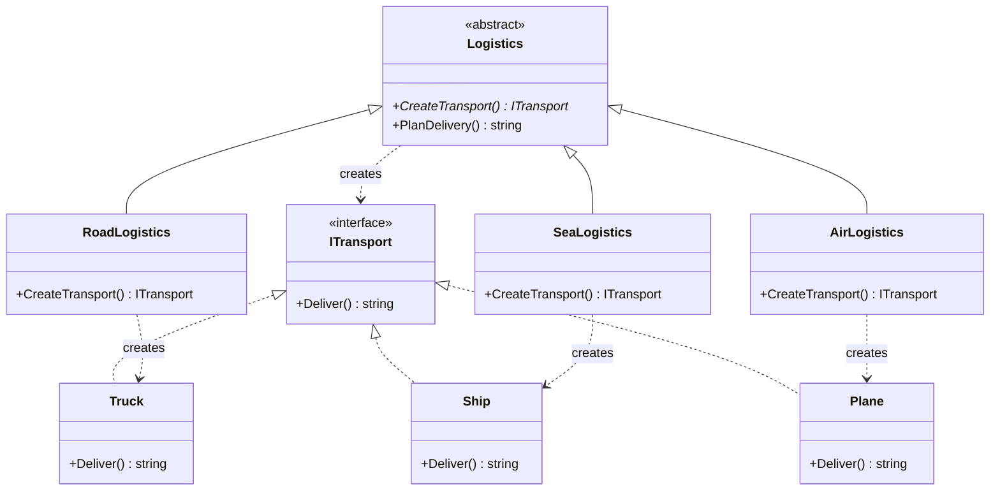
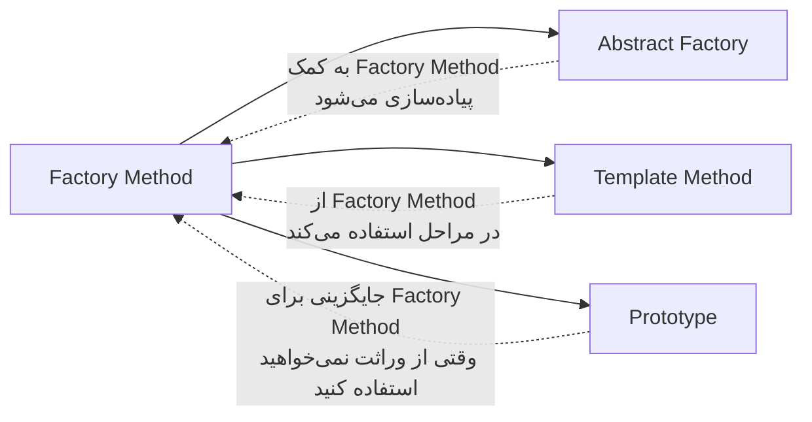

# 🏭 الگوی Factory Method (فکتوری متد)

## 🎯 هدف

الگوی **Factory Method** یک الگوی طراحی سازنده است که **رابطی برای ایجاد اشیاء تعریف می‌کند، اما تصمیم‌گیری درباره نوع دقیق شیء را به زیرکلاس‌ها واگذار می‌کند**. این الگو به زیرکلاس‌ها اجازه می‌دهد تا نوع اشیاء ساخته‌شده را تغییر دهند.

## 🤔 مشکل

فرض کنید در حال توسعه یک سیستم مدیریت لجستیک هستید. نسخه اولیه شما فقط **حمل‌ونقل جاده‌ای** (با کامیون) را پشتیبانی می‌کند، بنابراین بیشتر کدهای شما در کلاس `Truck` قرار دارد.

بعد از مدتی، برنامه شما محبوب می‌شود و درخواست‌های زیادی برای اضافه کردن **حمل‌ونقل دریایی** دریافت می‌کنید. خبر خوبی است! اما کد چطور؟

در حال حاضر، بیشتر کدهای شما به کلاس `Truck` وابسته است. افزودن `Ship` به برنامه نیاز به تغییرات عمده در کل codebase دارد. علاوه بر این، اگر بعداً تصمیم بگیرید نوع دیگری از حمل‌ونقل (مثلاً هوایی) اضافه کنید، احتمالاً باید دوباره تمام این تغییرات را انجام دهید.

نتیجه؟ کدی پر از شرط‌های conditional که رفتار برنامه را بسته به کلاس اشیاء حمل‌ونقل تغییر می‌دهد.

## 💡 راه‌حل

الگوی Factory Method پیشنهاد می‌کند که **ایجاد مستقیم اشیاء** (با استفاده از عملگر `new`) را با فراخوانی یک **متد کارخانه‌ای (factory method)** جایگزین کنید. اشیاء همچنان از طریق `new` ایجاد می‌شوند، اما این کار داخل متد factory انجام می‌شود.

زیرکلاس‌ها می‌توانند متد factory را override کنند و نوع محصولاتی که ایجاد می‌شوند را تغییر دهند.

## 📊 ساختار



## 👥 اجزای الگو

1. **Product (ITransport)**: رابط مشترک برای تمام محصولاتی که factory method ایجاد می‌کند
2. **Concrete Products (Truck, Ship, Plane)**: پیاده‌سازی‌های مختلف رابط Product
3. **Creator (Logistics)**: کلاسی که متد factory را اعلام می‌کند. ممکن است پیاده‌سازی پیش‌فرض داشته باشد
4. **Concrete Creators (RoadLogistics, SeaLogistics)**: متد factory را override می‌کنند تا نوع محصول متفاوتی برگردانند

## 💻 پیاده‌سازی با C#

```csharp
using System;

namespace FactoryMethodPattern
{
    // Product Interface
    public interface ITransport
    {
        string Deliver();
    }

    // Concrete Products
    public class Truck : ITransport
    {
        public string Deliver()
        {
            return "🚚 حمل و نقل زمینی با کامیون";
        }
    }

    public class Ship : ITransport
    {
        public string Deliver()
        {
            return "🚢 حمل و نقل دریایی با کشتی";
        }
    }

    public class Plane : ITransport
    {
        public string Deliver()
        {
            return "✈️ حمل و نقل هوایی با هواپیما";
        }
    }

    // Creator
    public abstract class Logistics
    {
        // Factory Method
        public abstract ITransport CreateTransport();

        // Business logic که از factory method استفاده می‌کند
        public string PlanDelivery()
        {
            var transport = CreateTransport();
            return $"📦 لجستیک: برنامه‌ریزی تحویل...\n{transport.Deliver()}";
        }
    }

    // Concrete Creators
    public class RoadLogistics : Logistics
    {
        public override ITransport CreateTransport()
        {
            return new Truck();
        }
    }

    public class SeaLogistics : Logistics
    {
        public override ITransport CreateTransport()
        {
            return new Ship();
        }
    }

    public class AirLogistics : Logistics
    {
        public override ITransport CreateTransport()
        {
            return new Plane();
        }
    }

    // Client Code
    class Program
    {
        static void Main(string[] args)
        {
            Console.OutputEncoding = System.Text.Encoding.UTF8;
            Console.WriteLine("🏭 الگوی Factory Method در عمل\n");

            Console.WriteLine("📍 لجستیک جاده‌ای:");
            ClientCode(new RoadLogistics());

            Console.WriteLine("\n📍 لجستیک دریایی:");
            ClientCode(new SeaLogistics());

            Console.WriteLine("\n📍 لجستیک هوایی:");
            ClientCode(new AirLogistics());
        }

        static void ClientCode(Logistics logistics)
        {
            Console.WriteLine(logistics.PlanDelivery());
            Console.WriteLine(new string('-', 50));
        }
    }
}
```

### خروجی برنامه:

```
🏭 الگوی Factory Method در عمل

📍 لجستیک جاده‌ای:
📦 لجستیک: برنامه‌ریزی تحویل...
🚚 حمل و نقل زمینی با کامیون
--------------------------------------------------

📍 لجستیک دریایی:
📦 لجستیک: برنامه‌ریزی تحویل...
🚢 حمل و نقل دریایی با کشتی
--------------------------------------------------

📍 لجستیک هوایی:
📦 لجستیک: برنامه‌ریزی تحویل...
✈️ حمل و نقل هوایی با هواپیما
--------------------------------------------------
```

## 🎯 مثال کاربردی: سیستم گزارش‌گیری

```csharp
// Product Interface
public interface IReport
{
    string Generate();
}

// Concrete Products
public class PdfReport : IReport
{
    public string Generate() => "📄 گزارش PDF تولید شد";
}

public class ExcelReport : IReport
{
    public string Generate() => "📊 گزارش Excel تولید شد";
}

public class HtmlReport : IReport
{
    public string Generate() => "🌐 گزارش HTML تولید شد";
}

// Creator
public abstract class ReportGenerator
{
    public abstract IReport CreateReport();

    public string ExportReport()
    {
        var report = CreateReport();
        return $"🔄 در حال صادرکردن...\n{report.Generate()}";
    }
}

// Concrete Creators
public class PdfReportGenerator : ReportGenerator
{
    public override IReport CreateReport() => new PdfReport();
}

public class ExcelReportGenerator : ReportGenerator
{
    public override IReport CreateReport() => new ExcelReport();
}

public class HtmlReportGenerator : ReportGenerator
{
    public override IReport CreateReport() => new HtmlReport();
}

// استفاده
var pdfGen = new PdfReportGenerator();
Console.WriteLine(pdfGen.ExportReport());
// 🔄 در حال صادرکردن...
// 📄 گزارش PDF تولید شد
```

## 🎯 مثال کاربردی: سیستم پرداخت

```csharp
public interface IPaymentMethod
{
    string ProcessPayment(decimal amount);
}

public class CreditCardPayment : IPaymentMethod
{
    public string ProcessPayment(decimal amount)
        => $"💳 پرداخت {amount:N0} تومان با کارت اعتباری انجام شد";
}

public class PayPalPayment : IPaymentMethod
{
    public string ProcessPayment(decimal amount)
        => $"🌐 پرداخت {amount:N0} تومان با PayPal انجام شد";
}

public class CryptoPayment : IPaymentMethod
{
    public string ProcessPayment(decimal amount)
        => $"₿ پرداخت {amount:N0} تومان با ارز دیجیتال انجام شد";
}

public abstract class PaymentProcessor
{
    public abstract IPaymentMethod CreatePaymentMethod();

    public string Pay(decimal amount)
    {
        var method = CreatePaymentMethod();
        return method.ProcessPayment(amount);
    }
}

public class CreditCardProcessor : PaymentProcessor
{
    public override IPaymentMethod CreatePaymentMethod()
        => new CreditCardPayment();
}
```

## ⚖️ مزایا و معایب

### مزایا ✅

- **اصل تک مسئولیتی**: کد ایجاد محصول را در یک مکان جمع می‌کنید، maintenance آسان‌تر می‌شود
- **اصل باز/بسته**: می‌توانید انواع جدید محصولات را بدون شکستن کد موجود اضافه کنید
- **انعطاف‌پذیری**: زیرکلاس‌ها کنترل کاملی بر نوع اشیائی که ایجاد می‌شوند دارند
- **جداسازی**: کد کلاینت از کلاس‌های محصول مشخص جدا می‌شود

### معایب ❌

- **پیچیدگی**: کد ممکن است پیچیده‌تر شود زیرا نیاز به زیرکلاس‌های زیادی دارید
- **سلسله‌مراتب**: باید سلسله‌مراتب موازی از creators و products نگهداری کنید

## 🔍 چه زمانی استفاده کنیم؟

✅ **استفاده کنید وقتی:**

1. **نمی‌دانید از پیش چه نوع دقیقی از اشیاء** در زمان اجرا نیاز خواهید داشت
2. می‌خواهید به **کاربران کتابخانه/framework** امکان گسترش اجزای داخلی را بدهید
3. می‌خواهید با **استفاده مجدد از اشیاء موجود** به جای ساخت مجدد، منابع سیستم را ذخیره کنید
4. کد شما نیاز به **انعطاف‌پذیری** برای افزودن انواع جدید محصولات دارد

❌ **استفاده نکنید وقتی:**

1. انواع محصولات **ثابت** هستند و احتمال تغییر ندارند
2. **پیچیدگی اضافی** را justify نمی‌کند (برای موارد ساده، ایجاد مستقیم بهتر است)

## 📚 ارتباط با الگوهای دیگر



- **Abstract Factory**: معمولاً بر اساس مجموعه‌ای از Factory Methods پیاده‌سازی می‌شود
- **Template Method**: Factory Method نوع خاصی از Template Method است
- **Prototype**: جایگزین Factory Method وقتی نمی‌خواهید از وراثت استفاده کنید

## 🎓 نکات پیاده‌سازی

1. **رابط مشترک**: همه محصولات باید همان رابط را پیاده‌سازی کنند
2. **پیاده‌سازی پیش‌فرض**: متد factory در کلاس پایه می‌تواند پیاده‌سازی پیش‌فرض داشته باشد
3. **نامگذاری واضح**: از نام‌های واضح استفاده کنید: `CreateXXX`, `BuildXXX`, `MakeXXX`
4. **پارامترها**: در نظر بگیرید از پارامترها برای کنترل نوع محصول استفاده کنید (اگر لازم باشد)

## 💡 نکات عملی

- در C#، می‌توانید از **Generic Factory Method** استفاده کنید:
  ```csharp
  public abstract class Creator<T> where T : IProduct
  {
      public abstract T CreateProduct();
  }
  ```

- برای **Dependency Injection** در ASP.NET Core، Factory Method بسیار مفید است:
  ```csharp
  services.AddScoped<ITransport, Truck>();
  ```

- می‌توانید با **Lazy Initialization** ترکیب کنید برای بهبود performance

---

> **💡 نکته کلیدی**: Factory Method به شما کمک می‌کند کد انعطاف‌پذیری بنویسید که در آینده به راحتی قابل گسترش باشد، بدون نیاز به تغییر کد موجود!

**[🏠 بازگشت به صفحه اصلی](../index.html)**
