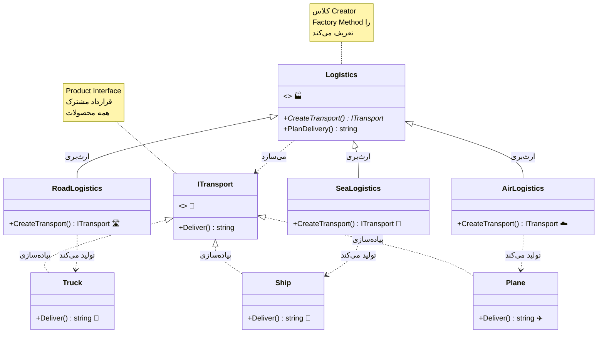
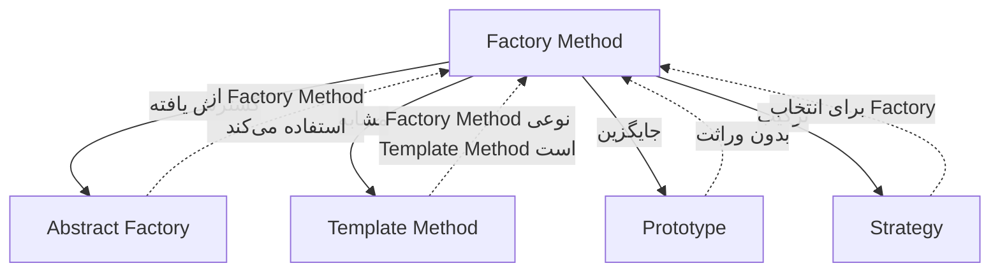

# 🏭 الگوی Factory Method (فکتوری متد)

## 🎯 هدف

الگوی **Factory Method** یک الگوی طراحی سازنده (Creational) است که **رابطی برای ایجاد اشیاء تعریف می‌کند، اما تصمیم‌گیری درباره نوع دقیق شیء را به زیرکلاس‌ها واگذار می‌کند**. این الگو به زیرکلاس‌ها اجازه می‌دهد تا نوع اشیاء ساخته‌شده را تغییر دهند.

به زبان ساده‌تر، Factory Method مانند یک **کارخانه هوشمند** است که بسته به شرایط، محصولات مختلفی تولید می‌کند. شما به کارخانه می‌گویید "یک محصول بساز" اما کارخانه خودش تصمیم می‌گیرد که چه نوع محصولی بسازد.

## 🤔 مشکل

تصور کنید در حال توسعه یک سیستم **مدیریت لجستیک** هستید. نسخه اولیه شما فقط **حمل‌ونقل جاده‌ای** (با کامیون) را پشتیبانی می‌کند، بنابراین بیشتر کدهای شما در کلاس `Truck` قرار دارد.

```csharp
// کد اولیه - فقط کامیون!
public class LogisticsApp
{
    public void PlanDelivery()
    {
        Truck truck = new Truck();
        truck.Deliver();
    }
}
```

بعد از مدتی، برنامه شما محبوب می‌شود و مشتریان درخواست می‌کنند که **حمل‌ونقل دریایی** هم اضافه کنید. خبر خوب! اما کد چطور؟ 😰

### مشکلات رویکرد سنتی:

**1. وابستگی مستقیم به کلاس‌های مشخص**
```csharp
// مجبوریم در همه جا if-else بنویسیم
public void PlanDelivery(string type)
{
    if (type == "road")
    {
        Truck truck = new Truck();
        truck.Deliver();
    }
    else if (type == "sea")
    {
        Ship ship = new Ship();
        ship.Deliver();
    }
    // اگر بخواهیم هوایی اضافه کنیم، باید دوباره تمام این if-else ها را تغییر دهیم!
}
```

**2. نقض اصل Open/Closed**
- برای افزودن نوع جدید باید کد موجود را تغییر دهیم
- خطر ایجاد باگ در کدهای کارآمد موجود

**3. کد تکراری**
- همان منطق if-else در جاهای مختلف تکرار می‌شود
- نگهداری سخت

**4. تست سخت**
- نمی‌توانیم به راحتی Mock کنیم
- باید همه حالت‌ها را تست کنیم

**نتیجه**: کدی پر از شرط‌های conditional که با هر نوع جدید، پیچیده‌تر می‌شود! 🍝

## 💡 راه‌حل

الگوی Factory Method این مشکل را با **تفویض مسئولیت ساخت** حل می‌کند:

1. **رابط مشترک**: همه وسایل حمل‌ونقل یک رابط مشترک پیاده‌سازی می‌کنند
2. **متد کارخانه**: یک متد abstract برای ساخت وسیله نقلیه
3. **زیرکلاس‌ها**: هر نوع لجستیک، متد کارخانه را override می‌کند

```csharp
// با Factory Method - تمیز و انعطاف‌پذیر! ✨
public abstract class Logistics
{
    // Factory Method - زیرکلاس‌ها تصمیم می‌گیرند چه چیزی بسازند
    public abstract ITransport CreateTransport();
    
    public void PlanDelivery()
    {
        // کد ما دیگر به نوع خاص وابسته نیست!
        ITransport transport = CreateTransport();
        transport.Deliver();
    }
}

public class RoadLogistics : Logistics
{
    public override ITransport CreateTransport() => new Truck();
}

public class SeaLogistics : Logistics
{
    public override ITransport CreateTransport() => new Ship();
}
```

**مزایا:**
- ✅ افزودن نوع جدید بدون تغییر کد موجود
- ✅ کد تمیز و قابل نگهداری
- ✅ تست‌پذیری بالا
- ✅ انعطاف‌پذیری کامل

## 📊 ساختار



## 👥 اجزای الگو

| جزء | نقش | مثال |
|-----|-----|------|
| **Product** | رابط/کلاس پایه محصولات | `ITransport` |
| **Concrete Product** | پیاده‌سازی واقعی محصول | `Truck`, `Ship`, `Plane` |
| **Creator** | کلاس سازنده با Factory Method | `Logistics` |
| **Concrete Creator** | پیاده‌سازی Factory Method | `RoadLogistics`, `SeaLogistics` |

### نقش هر جزء:

1. **Product (ITransport)**: 
   - رابط مشترک برای تمام محصولاتی که factory method ایجاد می‌کند
   - قراردادی که همه محصولات باید رعایت کنند

2. **Concrete Products (Truck, Ship, Plane)**: 
   - پیاده‌سازی‌های مختلف رابط Product
   - محصولات واقعی که کارخانه تولید می‌کند

3. **Creator (Logistics)**: 
   - کلاسی که Factory Method را اعلام می‌کند
   - شامل منطق کسب‌وکار است که از محصولات استفاده می‌کند
   - ممکن است پیاده‌سازی پیش‌فرض برای Factory Method داشته باشد

4. **Concrete Creators (RoadLogistics, SeaLogistics)**: 
   - Factory Method را override می‌کنند
   - نوع محصول خاصی را برمی‌گردانند

## 💻 پیاده‌سازی با C#

```csharp
using System;

namespace FactoryMethodPattern
{
    // Product Interface
    public interface ITransport
    {
        string Deliver();
    }

    // Concrete Products
    public class Truck : ITransport
    {
        public string Deliver()
        {
            return "🚚 حمل و نقل زمینی با کامیون";
        }
    }

    public class Ship : ITransport
    {
        public string Deliver()
        {
            return "🚢 حمل و نقل دریایی با کشتی";
        }
    }

    public class Plane : ITransport
    {
        public string Deliver()
        {
            return "✈️ حمل و نقل هوایی با هواپیما";
        }
    }

    // Creator
    public abstract class Logistics
    {
        // Factory Method
        public abstract ITransport CreateTransport();

        // Business logic که از factory method استفاده می‌کند
        public string PlanDelivery()
        {
            var transport = CreateTransport();
            return $"📦 لجستیک: برنامه‌ریزی تحویل...\n{transport.Deliver()}";
        }
    }

    // Concrete Creators
    public class RoadLogistics : Logistics
    {
        public override ITransport CreateTransport()
        {
            return new Truck();
        }
    }

    public class SeaLogistics : Logistics
    {
        public override ITransport CreateTransport()
        {
            return new Ship();
        }
    }

    public class AirLogistics : Logistics
    {
        public override ITransport CreateTransport()
        {
            return new Plane();
        }
    }

    // Client Code
    class Program
    {
        static void Main(string[] args)
        {
            Console.OutputEncoding = System.Text.Encoding.UTF8;
            Console.WriteLine("🏭 الگوی Factory Method در عمل\n");

            Console.WriteLine("📍 لجستیک جاده‌ای:");
            ClientCode(new RoadLogistics());

            Console.WriteLine("\n📍 لجستیک دریایی:");
            ClientCode(new SeaLogistics());

            Console.WriteLine("\n📍 لجستیک هوایی:");
            ClientCode(new AirLogistics());
        }

        static void ClientCode(Logistics logistics)
        {
            Console.WriteLine(logistics.PlanDelivery());
            Console.WriteLine(new string('-', 50));
        }
    }
}
```

### خروجی برنامه:

```
🏭 الگوی Factory Method در عمل

📍 لجستیک جاده‌ای:
📦 لجستیک: برنامه‌ریزی تحویل...
🚚 حمل و نقل زمینی با کامیون
--------------------------------------------------

📍 لجستیک دریایی:
📦 لجستیک: برنامه‌ریزی تحویل...
🚢 حمل و نقل دریایی با کشتی
--------------------------------------------------

📍 لجستیک هوایی:
📦 لجستیک: برنامه‌ریزی تحویل...
✈️ حمل و نقل هوایی با هواپیما
--------------------------------------------------
```

## 🎯 مثال کاربردی: سیستم گزارش‌گیری

```csharp
// Product Interface
public interface IReport
{
    string Generate();
}

// Concrete Products
public class PdfReport : IReport
{
    public string Generate() => "📄 گزارش PDF تولید شد";
}

public class ExcelReport : IReport
{
    public string Generate() => "📊 گزارش Excel تولید شد";
}

public class HtmlReport : IReport
{
    public string Generate() => "🌐 گزارش HTML تولید شد";
}

// Creator
public abstract class ReportGenerator
{
    public abstract IReport CreateReport();

    public string ExportReport()
    {
        var report = CreateReport();
        return $"🔄 در حال صادرکردن...\n{report.Generate()}";
    }
}

// Concrete Creators
public class PdfReportGenerator : ReportGenerator
{
    public override IReport CreateReport() => new PdfReport();
}

public class ExcelReportGenerator : ReportGenerator
{
    public override IReport CreateReport() => new ExcelReport();
}

public class HtmlReportGenerator : ReportGenerator
{
    public override IReport CreateReport() => new HtmlReport();
}

// استفاده
var pdfGen = new PdfReportGenerator();
Console.WriteLine(pdfGen.ExportReport());
// 🔄 در حال صادرکردن...
// 📄 گزارش PDF تولید شد
```

## 🎯 مثال کاربردی: سیستم پرداخت

```csharp
public interface IPaymentMethod
{
    string ProcessPayment(decimal amount);
}

public class CreditCardPayment : IPaymentMethod
{
    public string ProcessPayment(decimal amount)
        => $"💳 پرداخت {amount:N0} تومان با کارت اعتباری انجام شد";
}

public class PayPalPayment : IPaymentMethod
{
    public string ProcessPayment(decimal amount)
        => $"🌐 پرداخت {amount:N0} تومان با PayPal انجام شد";
}

public class CryptoPayment : IPaymentMethod
{
    public string ProcessPayment(decimal amount)
        => $"₿ پرداخت {amount:N0} تومان با ارز دیجیتال انجام شد";
}

public abstract class PaymentProcessor
{
    public abstract IPaymentMethod CreatePaymentMethod();

    public string Pay(decimal amount)
    {
        var method = CreatePaymentMethod();
        return method.ProcessPayment(amount);
    }
}

public class CreditCardProcessor : PaymentProcessor
{
    public override IPaymentMethod CreatePaymentMethod()
        => new CreditCardPayment();
}
```

## ⚖️ مزایا و معایب

### مزایا ✅

1. **اصل تک مسئولیتی (SRP)**: کد ساخت محصول در یک مکان متمرکز است
2. **اصل باز/بسته (OCP)**: افزودن انواع جدید بدون تغییر کد موجود
3. **انعطاف‌پذیری بالا**: زیرکلاس‌ها کنترل کامل روی نوع محصول دارند
4. **جداسازی (Decoupling)**: کد کلاینت از کلاس‌های محصول مشخص جدا است
5. **تست‌پذیری**: راحت‌تر می‌توان Mock کرد
6. **قابلیت گسترش**: افزودن نوع جدید بسیار آسان است
7. **کد تمیز**: بدون if-else یا switch-case های طولانی

### معایب ❌

1. **افزایش تعداد کلاس‌ها**: برای هر محصول جدید، یک Creator جدید نیاز است
2. **سلسله‌مراتب موازی**: باید هم Product و هم Creator را نگهداری کنید
3. **پیچیدگی اولیه**: برای سیستم‌های ساده، ممکن است بیش از حد پیچیده باشد
4. **یادگیری**: درک مفهوم برای مبتدیان کمی سخت است

## 🔍 چه زمانی استفاده کنیم؟

### ✅ استفاده کنید وقتی:

1. **نوع دقیق محصول مشخص نیست**: در زمان نوشتن کد نمی‌دانید چه نوع شیءای نیاز خواهید داشت
2. **نیاز به گسترش‌پذیری**: می‌خواهید سیستم را برای افزودن انواع جدید باز نگه دارید
3. **کتابخانه/Framework می‌سازید**: کاربران باید بتوانند اجزای داخلی را سفارشی کنند
4. **جداسازی لازم است**: می‌خواهید کد کلاینت را از جزئیات ساخت جدا کنید
5. **منطق ساخت پیچیده**: ساخت شیء شامل منطق پیچیده‌ای است
6. **چندین نوع مرتبط**: خانواده‌ای از محصولات مرتبط دارید

### ❌ استفاده نکنید وقتی:

1. **محصولات ثابت هستند**: انواع محصولات تغییر نمی‌کنند
2. **سیستم ساده است**: پیچیدگی اضافی توجیه ندارد
3. **یک نوع محصول**: فقط یک نوع محصول وجود دارد
4. **ساخت ساده است**: فقط `new Product()` کافی است
5. **استفاده از DI ساده‌تر است**: Dependency Injection راه‌حل بهتری است

## 🎯 کاربردهای واقعی

1. **ADO.NET Data Providers**: `DbProviderFactory` برای ساخت اتصالات مختلف DB
2. **ASP.NET Core**: `ILoggerFactory` برای ساخت loggerهای مختلف
3. **Entity Framework**: `DbContext` برای ساخت انواع مختلف database provider
4. **UI Frameworks**: ساخت کنترل‌های UI بر اساس platform (WPF, WinForms)
5. **Plugin Systems**: سیستم‌های پلاگین که انواع مختلف plugin می‌سازند
6. **Game Development**: ساخت انواع مختلف enemies، weapons، characters
7. **Document Processing**: تولید PDF، Word، Excel با همان interface

## 💡 نکات پیاده‌سازی و Best Practices

### 1. نامگذاری واضح
```csharp
// ✅ خوب - نام واضح
public abstract ITransport CreateTransport();
public abstract IDocument CreateDocument();

// ❌ بد - نام مبهم
public abstract ITransport Get();
public abstract IDocument Make();
```

### 2. پیاده‌سازی پیش‌فرض
```csharp
// می‌توانید پیاده‌سازی پیش‌فرض داشته باشید
public abstract class Logistics
{
    public virtual ITransport CreateTransport()
    {
        return new Truck(); // پیش‌فرض
    }
}
```

### 3. استفاده از Generic
```csharp
public abstract class Creator<T> where T : IProduct
{
    public abstract T CreateProduct();
    
    public void DoSomething()
    {
        var product = CreateProduct();
        product.Use();
    }
}
```

### 4. ترکیب با Dependency Injection
```csharp
// در ASP.NET Core
services.AddScoped<ITransportFactory, TruckFactory>();
```

### 5. Lazy Initialization
```csharp
public class CachedFactory : Creator
{
    private IProduct _cachedProduct;
    
    public override IProduct CreateProduct()
    {
        return _cachedProduct ??= new ConcreteProduct();
    }
}
```

## 🆚 مقایسه با الگوهای مشابه

| ویژگی | Factory Method | Abstract Factory | Builder | Prototype |
|-------|---------------|------------------|---------|-----------|
| هدف | ساخت **یک** محصول | ساخت **خانواده** محصولات | ساخت **گام‌به‌گام** | ساخت با **کپی** |
| پیچیدگی | متوسط | بالا | متوسط | پایین |
| تعداد محصول | یکی | چندتا | یکی | یکی |
| وراثت | بله | بله | خیر | خیر |
| استفاده | محصولات **مشابه** | محصولات **وابسته** | محصولات **پیچیده** | **Clone** موجود |

## 📚 ارتباط با الگوهای دیگر



### روابط:

- **Abstract Factory**: اغلب با Factory Method پیاده‌سازی می‌شود
- **Template Method**: Factory Method حالت خاصی از Template Method است
- **Prototype**: جایگزین Factory Method برای جلوگیری از سلسله‌مراتب پیچیده
- **Strategy**: می‌تواند برای انتخاب Factory Method مناسب استفاده شود
- **Singleton**: محصولات ساخته‌شده می‌توانند Singleton باشند

## 🔑 نکات کلیدی

> **💡 یادآوری مهم**: 
> 
> Factory Method برای زمانی است که می‌خواهید **فرآیند ساخت را به زیرکلاس‌ها بسپارید**. اگر فقط می‌خواهید ساخت را کپسوله کنید، از **Simple Factory** استفاده کنید.
>
> ```csharp
> // Simple Factory (ساده‌تر اما کمتر انعطاف‌پذیر)
> public class TransportFactory
> {
>     public ITransport Create(string type)
>     {
>         return type switch
>         {
>             "road" => new Truck(),
>             "sea" => new Ship(),
>             _ => throw new ArgumentException()
>         };
>     }
> }
> ```

## 🎓 سناریوهای واقعی

### مثال 1: سیستم Notification

```csharp
// استفاده در سیستم اعلان‌رسانی
public abstract class NotificationService
{
    public abstract INotification CreateNotification();
    
    public void Send(string message)
    {
        var notification = CreateNotification();
        notification.Send(message);
    }
}

public class EmailNotificationService : NotificationService
{
    public override INotification CreateNotification() 
        => new EmailNotification();
}

public class SmsNotificationService : NotificationService
{
    public override INotification CreateNotification() 
        => new SmsNotification();
}

public class PushNotificationService : NotificationService
{
    public override INotification CreateNotification() 
        => new PushNotification();
}
```

### مثال 2: Data Export System

```csharp
public abstract class DataExporter
{
    public abstract IExportFormat CreateFormat();
    
    public void Export(Data data, string filename)
    {
        var format = CreateFormat();
        format.Export(data, filename);
        Console.WriteLine($"✅ داده با فرمت {format.GetType().Name} صادر شد");
    }
}

public class PdfExporter : DataExporter
{
    public override IExportFormat CreateFormat() => new PdfFormat();
}

public class CsvExporter : DataExporter
{
    public override IExportFormat CreateFormat() => new CsvFormat();
}
```

## ⚠️ اشتباهات رایج

### 1. استفاده بیش از حد
```csharp
// ❌ بد - برای یک کلاس ساده نیازی به Factory Method نیست
public abstract class SimpleObjectFactory
{
    public abstract SimpleObject Create();
}

// ✅ خوب - استفاده مستقیم
var obj = new SimpleObject();
```

### 2. نقض اصل Liskov Substitution
```csharp
// ❌ بد - زیرکلاس نوع متفاوتی برمی‌گرداند
public class BadCreator : Creator
{
    public override IProduct CreateProduct()
    {
        return null; // ❌ اشتباه!
    }
}
```

### 3. وابستگی به پیاده‌سازی خاص
```csharp
// ❌ بد - استفاده از کلاس مشخص
public void Process()
{
    Truck truck = (Truck)CreateTransport(); // ❌ اشتباه!
    truck.LoadCargo();
}

// ✅ خوب - استفاده از رابط
public void Process()
{
    ITransport transport = CreateTransport();
    transport.Deliver();
}
```

## 🎯 خلاصه

Factory Method یک الگوی قدرتمند است که:
- ✅ **انعطاف‌پذیری** به کد شما می‌دهد
- ✅ **قابلیت گسترش** بدون تغییر کد موجود
- ✅ **جداسازی** بین ساخت و استفاده
- ✅ **تست‌پذیری** بالا با امکان Mock کردن

اما مناسب نیست برای:
- ❌ سیستم‌های بسیار ساده
- ❌ زمانی که محصولات ثابت هستند
- ❌ وقتی DI می‌تواند نیاز را برآورده کند

---

**[🏠 بازگشت به صفحه اصلی](../index.html)**
