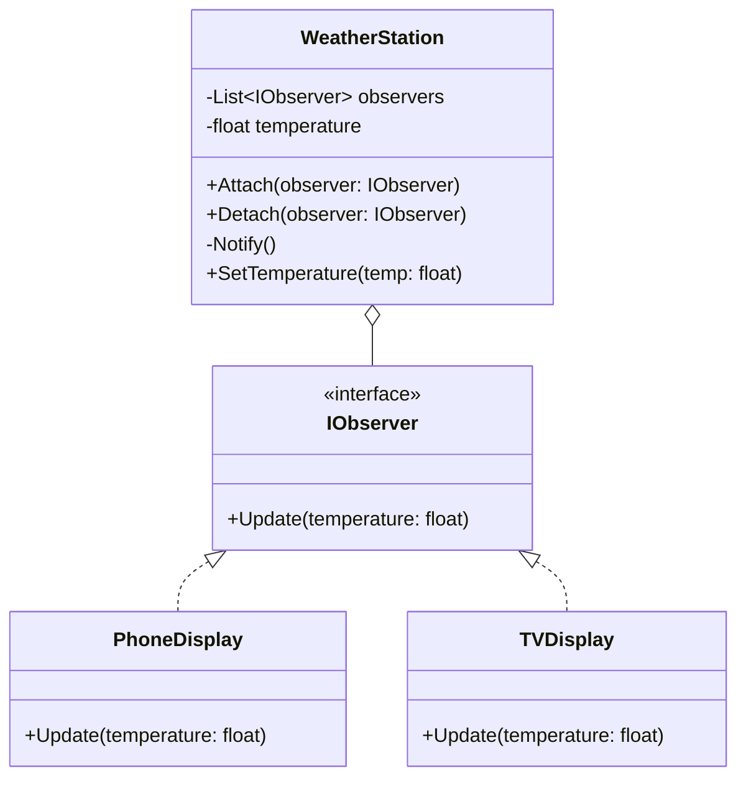

# الگوی Observer (ناظر / مشاهده‌گر)

## 🎯 هدف
الگوی Observer یک الگوی طراحی رفتاری است که به شما اجازه می‌دهد یک مکانیسم اشتراک تعریف کنید تا اشیاء متعددی را از رویدادهایی که برای شیءای که مشاهده می‌کنند رخ می‌دهد، مطلع کنید.

## 💻 مثال کد (C#)

```csharp
using System;
using System.Collections.Generic;

// رابط Observer - ناظر
public interface IObserver
{
    void Update(float temperature);
}

// کلاس Subject - موضوع (قابل مشاهده)
public class WeatherStation
{
    private List<IObserver> _observers = new List<IObserver>();
    private float _temperature;

    // اضافه کردن ناظر
    public void Attach(IObserver observer)
    {
        _observers.Add(observer);
        Console.WriteLine("✅ ناظر جدید اضافه شد");
    }

    // حذف ناظر
    public void Detach(IObserver observer)
    {
        _observers.Remove(observer);
    }

    // اطلاع‌رسانی به تمام ناظرها
    private void Notify()
    {
        foreach (var observer in _observers)
        {
            observer.Update(_temperature);
        }
    }

    // تنظیم دمای جدید و اطلاع‌رسانی
    public void SetTemperature(float temp)
    {
        Console.WriteLine($"🌡️ دمای جدید: {temp}°C");
        _temperature = temp;
        Notify();
    }
}

// نمایشگر موبایل - یک ناظر مشخص
public class PhoneDisplay : IObserver
{
    public void Update(float temperature)
    {
        Console.WriteLine($"📱 نمایشگر موبایل: دما {temperature}°C است");
    }
}

// نمایشگر تلویزیون - یک ناظر دیگر
public class TVDisplay : IObserver
{
    public void Update(float temperature)
    {
        Console.WriteLine($"📺 نمایشگر TV: دما {temperature}°C است");
    }
}

// استفاده از الگو
class Program
{
    static void Main()
    {
        WeatherStation weatherStation = new WeatherStation();

        PhoneDisplay phone = new PhoneDisplay();
        TVDisplay tv = new TVDisplay();

        weatherStation.Attach(phone);
        weatherStation.Attach(tv);

        weatherStation.SetTemperature(25);
        weatherStation.SetTemperature(30);
    }
}

/* خروجی:
✅ ناظر جدید اضافه شد
✅ ناظر جدید اضافه شد
🌡️ دمای جدید: 25°C
📱 نمایشگر موبایل: دما 25°C است
📺 نمایشگر TV: دما 25°C است
🌡️ دمای جدید: 30°C
📱 نمایشگر موبایل: دما 30°C است
📺 نمایشگر TV: دما 30°C است
*/
```

## 🔍 چه زمانی استفاده کنیم؟

1. **وابستگی یک-به-چند**: زمانی که تغییر در حالت یک شیء نیاز به تغییر اشیاء متعدد دیگر دارد
2. **Event Handling**: برای پیاده‌سازی سیستم‌های رویداد محور
3. **اشتراک موقت**: زمانی که برخی اشیاء باید اشیاء دیگر را فقط برای مدت محدودی مشاهده کنند
4. **Real-time Updates**: سیستم‌هایی که نیاز به به‌روزرسانی خودکار دارند

## ✅ مزایا

- **جداسازی (Loose Coupling)**: Subject و Observer به صورت شل به هم متصل هستند
- **انعطاف‌پذیری**: می‌توان به راحتی Observer های جدید اضافه یا حذف کرد
- **اصل Open/Closed**: می‌توان Observer های جدید بدون تغییر کد Subject اضافه کرد
- **پشتیبانی از Broadcast**: یک تغییر به همه Observer ها اطلاع داده می‌شود

## ❌ معایب

- **ترتیب نامشخص**: ترتیب اطلاع‌رسانی به Observer ها قابل پیش‌بینی نیست
- **نشت حافظه (Memory Leak)**: اگر Observer ها به درستی حذف نشوند، می‌توانند باعث نشت حافظه شوند
- **پیچیدگی**: در سیستم‌های بزرگ، ردیابی جریان داده سخت می‌شود
- **به‌روزرسانی‌های غیرضروری**: ممکن است Observer هایی که نیازی به اطلاع ندارند هم آپدیت شوند

## 📊 نمودار کلاس



## 🎯 کاربردهای واقعی

1. **سیستم‌های Event Handling**: مدیریت رویدادها در UI
2. **MVC Pattern**: ارتباط بین Model و View
3. **RSS Feeds**: اشتراک و دریافت اطلاعات
4. **Social Media**: اطلاع‌رسانی به دنبال‌کنندگان
5. **IoT**: سنسورها و سیستم‌های مانیتورینگ
6. **Stock Market**: به‌روزرسانی قیمت‌ها

## 🔑 نکات کلیدی

- Observer همان الگوی **Publish-Subscribe** است
- در C# از event ها و delegate ها برای پیاده‌سازی استفاده می‌شود
- باید مراقب نشت حافظه بود (همیشه Detach کنید)
- می‌توان Observer های مختلفی با رفتارهای متفاوت داشت

---

> **یادآوری**: Observer یک سیستم اشتراک/اطلاع‌رسانی قدرتمند ایجاد می‌کند که به شما امکان می‌دهد تغییرات را به صورت خودکار به تمام اشیاء وابسته اطلاع دهید! 👁️
