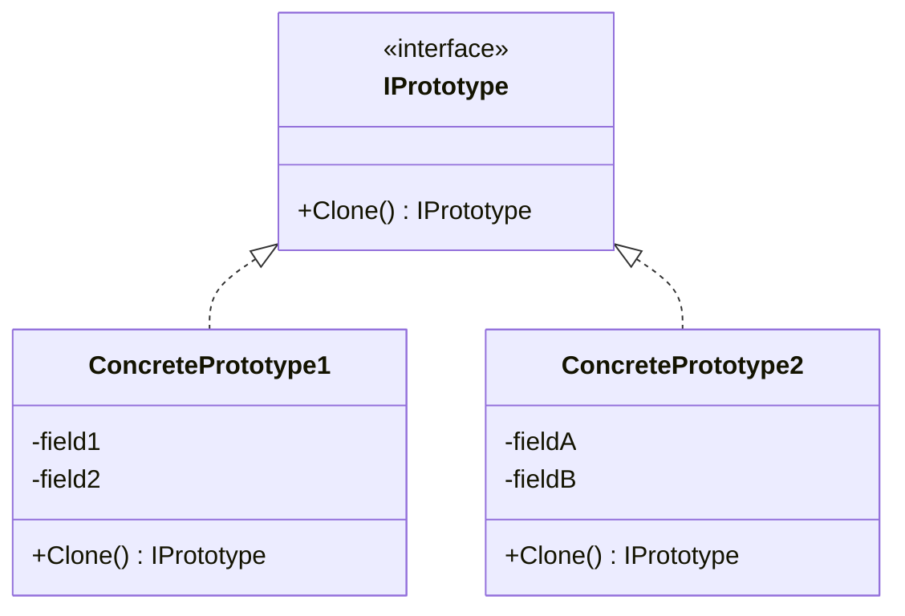

# 🧬 الگوی نمونه اولیه (Prototype)

## 🎯 هدف

**کپی کردن اشیاء موجود بدون وابستگی به کلاس‌های آن‌ها**

## 🤔 مشکل

ساخت یک کپی دقیق از شیء سخت است، به خصوص اگر فیلدهای private داشته باشد یا ساخت اولیه پرهزینه باشد.

## 💡 راه‌حل

Prototype فرآیند کلون را به خود اشیاء واگذار می‌کند. رابط مشترکی برای کلون تعریف می‌کنید.

## 📊 ساختار



## 💻 پیاده‌سازی با C#

```csharp
// Prototype Interface
public interface IShape
{
    IShape Clone();
    string Draw();
}

// Concrete Prototypes
public class Circle : IShape
{
    public int Radius { get; set; }
    public string Color { get; set; }

    public Circle(int radius, string color)
    {
        Radius = radius;
        Color = color;
        Console.WriteLine($"⚙️ ساخت دایره جدید (پرهزینه!)");
    }

    // Copy Constructor
    private Circle(Circle source)
    {
        Radius = source.Radius;
        Color = source.Color;
        Console.WriteLine($"📋 کلون دایره (سریع!)");
    }

    public IShape Clone()
    {
        return new Circle(this);
    }

    public string Draw()
    {
        return $"⭕ دایره {Color} با شعاع {Radius}";
    }
}

public class Rectangle : IShape
{
    public int Width { get; set; }
    public int Height { get; set; }
    public string Color { get; set; }

    public Rectangle(int width, int height, string color)
    {
        Width = width;
        Height = height;
        Color = color;
    }

    private Rectangle(Rectangle source)
    {
        Width = source.Width;
        Height = source.Height;
        Color = source.Color;
    }

    public IShape Clone()
    {
        return new Rectangle(this);
    }

    public string Draw()
    {
        return $"▭ مستطیل {Color} {Width}x{Height}";
    }
}
```

## 🎯 مثال کاربردی

```csharp
// استفاده
var originalCircle = new Circle(10, "قرمز");
Console.WriteLine(originalCircle.Draw());

// کلون کردن سریع
var clonedCircle = (Circle)originalCircle.Clone();
clonedCircle.Radius = 20;
clonedCircle.Color = "آبی";

Console.WriteLine(originalCircle.Draw());
Console.WriteLine(clonedCircle.Draw());

// خروجی:
// ⚙️ ساخت دایره جدید (پرهزینه!)
// ⭕ دایره قرمز با شعاع 10
// 📋 کلون دایره (سریع!)
// ⭕ دایره قرمز با شعاع 10
// ⭕ دایره آبی با شعاع 20
```

## ⚖️ مزایا و معایب

### مزایا ✅

- کلون کردن سریع‌تر از ساخت جدید است
- از کد تکراری جلوگیری می‌کند
- از ساخت زیرکلاس‌های متعدد جلوگیری می‌کند
- اشیاء پیچیده را راحت‌تر می‌سازد

### معایب ❌

- کلون کردن اشیاء با referenceهای circular سخت است
- پیاده‌سازی Clone برای کلاس‌های پیچیده دشوار است

## 🔍 چه زمانی استفاده کنیم?

✅ کد نباید به کلاس‌های مشخص اشیاء وابسته باشد
✅ ساخت شیء جدید گران است (IO، DB، network)
✅ تعداد زیرکلاس‌ها را می‌خواهید کاهش دهید

---

> **💡 یادآوری**: این الگو به شما کمک می‌کند کد با کیفیت‌تر و قابل نگهداری‌تر بنویسید!

**[🏠 بازگشت به صفحه اصلی](../index.html)**
