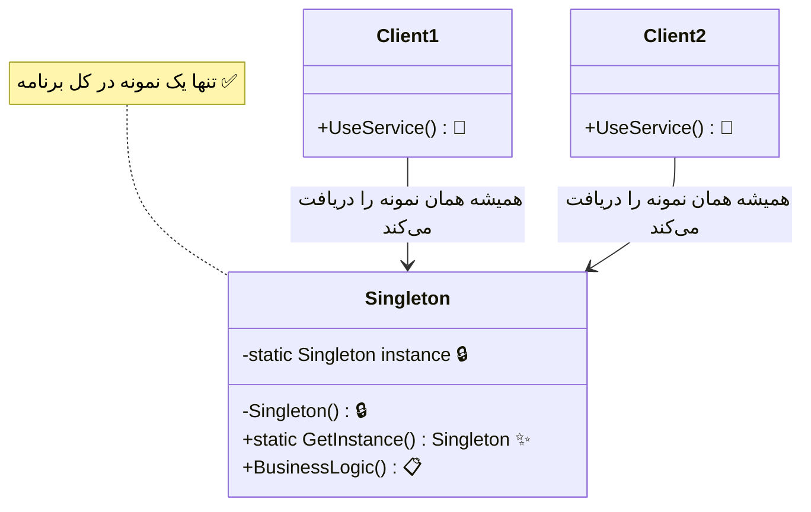

# 👑 الگوی تک‌نمونه (Singleton)

## 🎯 هدف

الگوی **Singleton** یک الگوی طراحی سازنده (Creational) است که **تضمین می‌کند یک کلاس تنها یک نمونه (instance) داشته باشد** و یک نقطه دسترسی سراسری (global access point) به آن نمونه فراهم می‌کند.

به عبارت دیگر، این الگو اطمینان می‌دهد که از یک کلاس فقط یک شیء در کل برنامه ایجاد شود و همه بخش‌های برنامه از همان یک نمونه استفاده کنند.

## 🤔 مشکل

در برنامه‌نویسی، گاهی اوقات نیاز داریم که از یک کلاس خاص **فقط یک نمونه** در کل برنامه وجود داشته باشد. به عنوان مثال:

- **مدیر پیکربندی (Configuration Manager)**: تنظیمات برنامه باید در یک جا ذخیره و مدیریت شوند
- **Logger (ثبت‌کننده رویدادها)**: تمام log‌ها باید در یک فایل یا سیستم واحد ثبت شوند
- **Connection Pool**: مدیریت متمرکز اتصالات به پایگاه داده
- **Driver Manager**: مدیریت درایورهای سخت‌افزاری
- **Cache Manager**: مدیریت کش داده‌ها در حافظه

اگر بدون Singleton عمل کنیم، ممکن است چندین نمونه از این کلاس‌ها ایجاد شود که منجر به:
- **مصرف بیشتر منابع** (حافظه، فایل‌ها، اتصالات)
- **عدم هماهنگی داده‌ها** (هر نمونه داده‌های متفاوتی دارد)
- **پیچیدگی در مدیریت** (نمی‌دانیم کدام نمونه را استفاده کنیم)

**مثال واقعی**: فرض کنید در برنامه شما یک کلاس `DatabaseConnection` دارید. اگر هر بار که نیاز به دسترسی به دیتابیس دارید یک نمونه جدید بسازید، ممکن است صدها اتصال باز به دیتابیس داشته باشید که منابع سرور را به اتمام می‌رساند!

## 💡 راه‌حل

الگوی Singleton این مشکل را با دو قدم حل می‌کند:

1. **سازنده (Constructor) را private کنید**: تا کسی نتواند با `new` مستقیماً شیء بسازد
2. **یک متد static عمومی ایجاد کنید**: که به عنوان سازنده عمل می‌کند و نمونه واحد را برمی‌گرداند

این متد در اولین فراخوانی، شیء را می‌سازد و در فراخوانی‌های بعدی همان شیء را برمی‌گرداند.

## 📊 ساختار



## 💻 پیاده‌سازی با C#

### روش اول: Thread-Safe با Double-Check Locking

```csharp
public sealed class ConfigurationManager
{
    private static ConfigurationManager _instance;
    private static readonly object _lock = new object();

    public Dictionary<string, string> Settings { get; }

    // سازنده private - کسی نمی‌تواند مستقیماً شیء بسازد
    private ConfigurationManager()
    {
        Settings = new Dictionary<string, string>
        {
            { "AppName", "MyApp" },
            { "Version", "1.0" },
            { "Database", "SQL Server" }
        };
    }

    // متد استاتیک برای دریافت نمونه واحد
    public static ConfigurationManager Instance
    {
        get
        {
            // بررسی اول: بدون lock برای بهبود کارایی
            if (_instance == null)
            {
                lock (_lock) // قفل برای thread-safety
                {
                    // بررسی دوم: درون lock
                    if (_instance == null)
                    {
                        _instance = new ConfigurationManager();
                    }
                }
            }
            return _instance;
        }
    }

    public string GetSetting(string key) => 
        Settings.TryGetValue(key, out var value) ? value : "Not Found";
}

// استفاده
class Program
{
    static void Main()
    {
        // هر دو متغیر به همان نمونه اشاره می‌کنند
        var config1 = ConfigurationManager.Instance;
        var config2 = ConfigurationManager.Instance;

        Console.WriteLine($"آیا یکسان هستند؟ {config1 == config2}"); // True
        Console.WriteLine($"نام برنامه: {config1.GetSetting("AppName")}"); // MyApp
        Console.WriteLine($"پایگاه داده: {config2.GetSetting("Database")}"); // SQL Server
    }
}
```

### روش دوم: Lazy Initialization (ساده‌تر و امن‌تر)

```csharp
public sealed class Logger
{
    // Lazy<T> خود thread-safe است
    private static readonly Lazy<Logger> _instance = 
        new Lazy<Logger>(() => new Logger());

    private Logger()
    {
        Console.WriteLine("✅ Logger ایجاد شد");
    }

    public static Logger Instance => _instance.Value;

    public void Log(string message) => 
        Console.WriteLine($"📝 [{DateTime.Now:HH:mm:ss}] {message}");
}

// استفاده
Logger.Instance.Log("برنامه شروع شد");
Logger.Instance.Log("عملیات انجام شد");
```

## 🎯 مثال واقعی: سیستم Cache

```csharp
public sealed class CacheManager
{
    private static readonly Lazy<CacheManager> _instance = 
        new Lazy<CacheManager>(() => new CacheManager());
    
    private readonly Dictionary<string, object> _cache = new();

    private CacheManager() { }

    public static CacheManager Instance => _instance.Value;

    public void Set(string key, object value) => _cache[key] = value;
    
    public T Get<T>(string key) => 
        _cache.TryGetValue(key, out var value) ? (T)value : default;

    public bool Exists(string key) => _cache.ContainsKey(key);
}

// استفاده
CacheManager.Instance.Set("user:1", new { Name = "علی", Age = 25 });
var user = CacheManager.Instance.Get<dynamic>("user:1");
Console.WriteLine($"نام: {user.Name}"); // علی
```

## ⚖️ مزایا و معایب

### مزایا ✅

1. **کنترل دسترسی به نمونه واحد**: تضمین می‌کند فقط یک نمونه وجود دارد
2. **دسترسی سراسری**: از هر نقطه از برنامه قابل دسترسی است
3. **مقداردهی تنبل (Lazy Initialization)**: نمونه فقط زمانی ساخته می‌شود که نیاز باشد
4. **صرفه‌جویی در منابع**: از ایجاد نمونه‌های اضافی جلوگیری می‌کند
5. **مدیریت متمرکز**: تمام عملیات از یک نقطه مدیریت می‌شوند
6. **Thread-Safe**: با پیاده‌سازی صحیح، در محیط‌های چندنخی امن است

### معایب ❌

1. **نقض اصل تک مسئولیتی**: کلاس هم مسئول منطق کسب‌وکار و هم مدیریت نمونه خود است
2. **سختی در تست**: Mock کردن Singleton در Unit Test دشوار است
3. **وابستگی سخت (Tight Coupling)**: کلاس‌های دیگر به Singleton وابسته می‌شوند
4. **مشکلات چندنخی**: اگر درست پیاده‌سازی نشود، می‌تواند مشکل ایجاد کند
5. **پنهان کردن وابستگی‌ها**: استفاده مستقیم از Instance باعث می‌شود وابستگی‌ها مشخص نباشند
6. **مشکل در محیط‌های توزیع‌شده**: در سیستم‌های چند سروری، هر سرور یک نمونه جداگانه دارد

## 🔍 چه زمانی استفاده کنیم؟

### ✅ استفاده کنید وقتی:

1. **دقیقاً یک نمونه نیاز دارید**: مثل مدیر پیکربندی، مدیر اتصال، Logger
2. **دسترسی سراسری لازم است**: همه بخش‌های برنامه باید به یک نمونه دسترسی داشته باشند
3. **کنترل دقیق روی منابع**: مدیریت منابع محدود مثل Connection Pool
4. **هماهنگی متمرکز**: عملیاتی که باید از یک نقطه هماهنگ شوند

### ❌ استفاده نکنید وقتی:

1. **نیاز به چندین نمونه دارید**: اگر ممکن است در آینده بیشتر از یک نمونه نیاز باشد
2. **تست‌پذیری مهم است**: Singleton تست واحد را سخت می‌کند
3. **می‌توان از Dependency Injection استفاده کرد**: DI راه‌حل بهتری است
4. **State قابل تغییر دارید**: اگر وضعیت تغییر می‌کند، مشکلات concurrency ایجاد می‌شود

## 🎯 کاربردهای واقعی

1. **مدیریت لاگ (Logging)**: یک Logger برای کل برنامه
2. **مدیریت پیکربندی (Configuration)**: تنظیمات برنامه
3. **Cache Manager**: مدیریت کش در حافظه
4. **Connection Pool**: مدیریت اتصالات به پایگاه داده
5. **Thread Pool**: مدیریت thread‌ها
6. **Print Spooler**: صف چاپ در سیستم‌عامل
7. **Device Drivers**: مدیریت سخت‌افزار

## 💡 نکات مهم پیاده‌سازی

1. **sealed class**: از کلمه کلیدی `sealed` استفاده کنید تا از وراثت جلوگیری شود
2. **private constructor**: سازنده باید private باشد
3. **Thread-Safety**: در محیط‌های چندنخی از `lock` یا `Lazy<T>` استفاده کنید
4. **Lazy Initialization**: ترجیحاً از `Lazy<T>` در C# استفاده کنید (ساده‌تر و امن‌تر)
5. **Eager vs Lazy**: 
   - **Eager**: نمونه در زمان بارگذاری کلاس ساخته می‌شود
   - **Lazy**: نمونه در اولین استفاده ساخته می‌شود

## 🆚 مقایسه با الگوهای مشابه

| ویژگی | Singleton | Static Class | Dependency Injection |
|-------|-----------|--------------|---------------------|
| نمونه‌سازی | یک نمونه | بدون نمونه | چندین نمونه ممکن |
| وراثت | می‌تواند interface پیاده کند | خیر | بله |
| تست‌پذیری | سخت | خیلی سخت | آسان |
| Lazy Loading | بله | خیر | بله |
| State | دارد | ندارد | دارد |

## 🔑 نکته کلیدی

> **هشدار**: از Singleton زیاد استفاده نکنید! این الگو یک **Anti-Pattern** محسوب می‌شود اگر بیش از حد استفاده شود. در برنامه‌های مدرن، **Dependency Injection** معمولاً گزینه بهتری است.
>
> در ASP.NET Core به جای Singleton دستی، از `services.AddSingleton<T>()` استفاده کنید.

---

**[🏠 بازگشت به صفحه اصلی](../index.html)**
