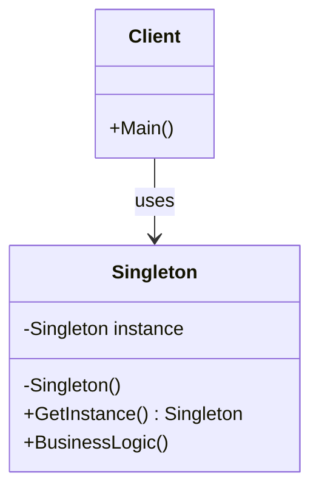

# 👑 الگوی تک‌نمونه (Singleton)

## 🎯 هدف

اطمینان از وجود تنها یک نمونه از کلاس با دسترسی سراسری

## 🤔 مشکل

گاهی نیاز دارید فقط یک نمونه از یک کلاس وجود داشته باشد - مثل connection pool، logger یا configuration manager

## 📊 ساختار



## 💻 پیاده‌سازی با C#

```csharp
public sealed class ConfigurationManager
{
    private static ConfigurationManager _instance;
    private static readonly object _lock = new object();

    public Dictionary<string, string> Settings { get; private set; }

    private ConfigurationManager()
    {
        Settings = new Dictionary<string, string>
        {
            { "AppName", "MyApp" },
            { "Version", "1.0" }
        };
    }

    public static ConfigurationManager Instance
    {
        get
        {
            if (_instance == null)
            {
                lock (_lock)
                {
                    if (_instance == null)
                    {
                        _instance = new ConfigurationManager();
                    }
                }
            }
            return _instance;
        }
    }

    public string GetSetting(string key)
    {
        return Settings.ContainsKey(key) ? Settings[key] : "Not Found";
    }
}

// استفاده
class Program
{
    static void Main()
    {
        var config1 = ConfigurationManager.Instance;
        var config2 = ConfigurationManager.Instance;

        Console.WriteLine(config1 == config2); // True
        Console.WriteLine(config1.GetSetting("AppName")); // MyApp
    }
}
```

## ⚖️ مزایا و معایب

### مزایا ✅
- کد تمیز و قابل نگهداری
- انعطاف‌پذیری بالا
- قابلیت توسعه

### معایب ❌
- پیچیدگی اولیه
- کد بیشتر

## 🔍 چه زمانی استفاده کنیم؟

این الگو را زمانی به کار ببرید که نیاز به انعطاف‌پذیری و توسعه‌پذیری دارید.

---

**[🏠 بازگشت به صفحه اصلی](../index.html)**
