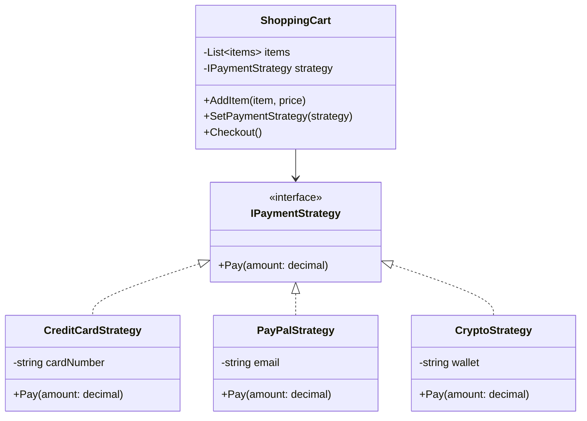

# الگوی Strategy (استراتژی / راهبرد)

## 🎯 هدف
الگوی Strategy یک الگوی طراحی رفتاری است که خانواده‌ای از الگوریتم‌ها را تعریف می‌کند، هر کدام را در کلاس جداگانه قرار می‌دهد و اشیاء آن‌ها را قابل تعویض می‌کند.

## 💻 مثال کد (C#)

```csharp
using System;
using System.Collections.Generic;
using System.Linq;

// رابط استراتژی پرداخت
public interface IPaymentStrategy
{
    void Pay(decimal amount);
}

// استراتژی پرداخت با کارت اعتباری
public class CreditCardStrategy : IPaymentStrategy
{
    private readonly string _cardNumber;

    public CreditCardStrategy(string cardNumber)
    {
        _cardNumber = cardNumber;
    }

    public void Pay(decimal amount)
    {
        Console.WriteLine($"💳 پرداخت {amount:N0} تومان با کارت {_cardNumber}");
    }
}

// استراتژی پرداخت با PayPal
public class PayPalStrategy : IPaymentStrategy
{
    private readonly string _email;

    public PayPalStrategy(string email)
    {
        _email = email;
    }

    public void Pay(decimal amount)
    {
        Console.WriteLine($"🌐 پرداخت {amount:N0} تومان با PayPal ({_email})");
    }
}

// استراتژی پرداخت با ارز دیجیتال
public class CryptoStrategy : IPaymentStrategy
{
    private readonly string _wallet;

    public CryptoStrategy(string wallet)
    {
        _wallet = wallet;
    }

    public void Pay(decimal amount)
    {
        Console.WriteLine($"₿ پرداخت {amount:N0} تومان با کریپتو ({_wallet})");
    }
}

// سبد خرید - Context
public class ShoppingCart
{
    private readonly List<(string Item, decimal Price)> _items = new();
    private IPaymentStrategy _paymentStrategy;

    public void AddItem(string item, decimal price)
    {
        _items.Add((item, price));
    }

    public void SetPaymentStrategy(IPaymentStrategy strategy)
    {
        _paymentStrategy = strategy;
    }

    public void Checkout()
    {
        decimal total = _items.Sum(item => item.Price);
        Console.WriteLine($"\n🛒 مجموع: {total:N0} تومان");
        
        if (_paymentStrategy != null)
        {
            _paymentStrategy.Pay(total);
        }
        else
        {
            Console.WriteLine("❌ روش پرداخت انتخاب نشده");
        }
    }
}

// استفاده از الگو
class Program
{
    static void Main()
    {
        ShoppingCart cart = new ShoppingCart();
        cart.AddItem("کتاب", 50000);
        cart.AddItem("قلم", 10000);

        // تغییر استراتژی در زمان اجرا
        cart.SetPaymentStrategy(new CreditCardStrategy("1234-5678-9012-3456"));
        cart.checkout();

        // تغییر به استراتژی دیگر
        cart.SetPaymentStrategy(new PayPalStrategy("user@example.com"));
        cart.Checkout();
    }
}

/* خروجی:
🛒 مجموع: 60,000 تومان
💳 پرداخت 60,000 تومان با کارت 1234-5678-9012-3456
🛒 مجموع: 60,000 تومان
🌐 پرداخت 60,000 تومان با PayPal (user@example.com)
*/
```

## 🔍 چه زمانی استفاده کنیم؟

1. **انواع مختلف الگوریتم**: زمانی که می‌خواهید انواع مختلف یک الگوریتم را استفاده کنید
2. **رفتارهای متنوع**: زمانی که کلاس‌های زیادی دارید که فقط در رفتارشان متفاوت هستند
3. **جداسازی الگوریتم**: زمانی که می‌خواهید الگوریتم را از کلاینت جدا کنید
4. **تغییر در زمان اجرا**: نیاز به تغییر رفتار در حین اجرا

## ✅ مزایا

- **انعطاف‌پذیری بالا**: تغییر رفتار در زمان اجرا
- **جداسازی**: الگوریتم‌ها از هم و از Context جدا هستند
- **اصل Open/Closed**: می‌توان استراتژی‌های جدید بدون تغییر Context اضافه کرد
- **جایگزین وراثت**: استفاده از Composition به جای Inheritance
- **حذف شرط‌های متعدد**: جایگزین برای if-else یا switch-case

## ❌ معایب

- **تعداد کلاس‌های بیشتر**: برای هر استراتژی یک کلاس جدید
- **پیچیدگی**: ممکن است برای الگوریتم‌های ساده، بیش از حد پیچیده باشد
- **آگاهی کلاینت**: کلاینت باید از تفاوت‌های بین استراتژی‌ها آگاه باشد

## 📊 نمودار کلاس



## 🎯 کاربردهای واقعی

1. **سیستم‌های پرداخت**: انتخاب روش پرداخت مختلف
2. **مرتب‌سازی**: الگوریتم‌های مختلف Sort (QuickSort, MergeSort, BubbleSort)
3. **فشرده‌سازی**: ZIP, RAR, 7Z
4. **Validation**: قوانین اعتبارسنجی مختلف
5. **تخفیف‌ها**: محاسبه تخفیف‌های مختلف در فروشگاه
6. **Navigation**: الگوریتم‌های مختلف مسیریابی

## 🔑 نکات کلیدی

- Strategy یک جایگزین عالی برای if-else و switch-case است
- در C# می‌توان از Delegate و Func<> هم استفاده کرد
- Context نباید از جزئیات پیاده‌سازی Strategy آگاه باشد
- Strategy و State شباهت دارند ولی State معمولاً Context را تغییر می‌دهد

---

> **یادآوری**: Strategy به شما اجازه می‌دهد الگوریتم را در زمان اجرا تغییر دهید و به راحتی استراتژی‌های جدید اضافه کنید! 🎯
